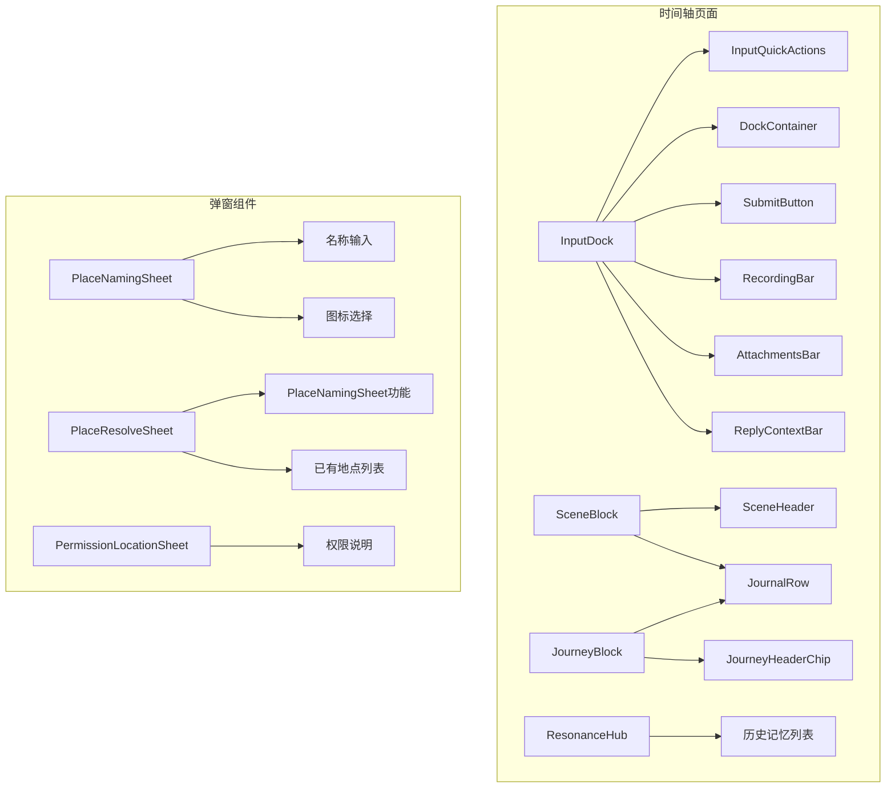

# 有机体组件 (Organisms)

> 返回 [文档中心](../INDEX.md) | [组件概览](./INDEX.md)

## 概述

有机体组件是由多个分子组件和原子组件组合而成的复杂 UI 结构，遵循 Atomic Design 设计方法论。这些组件实现了完整的功能区块，通常对应应用中的主要交互区域。

## 组件列表

| 组件名称 | 文件 | 用途 |
|---------|------|------|
| DocumentPicker | `DocumentPicker.swift` | 文档选择器 |
| ExpandedInputView | `ExpandedInputView.swift` | 展开输入视图 |
| InputDock | `InputDock.swift` | 输入停靠栏 |
| InputMenuPanel | `InputMenuPanel.swift` | 输入菜单面板 |
| JourneyBlock | `JourneyBlock.swift` | 旅程区块 |
| MorningBriefing | `MorningBriefing.swift` | 晨间简报 |
| PermissionLocationSheet | `PermissionLocationSheet.swift` | 位置权限弹窗 |
| PlaceNamingSheet | `PlaceNamingSheet.swift` | 地点命名弹窗 |
| PlaceResolveSheet | `PlaceResolveSheet.swift` | 地点解析弹窗 |
| ResonanceHub | `ResonanceHub.swift` | 共鸣中心 |
| SceneBlock | `SceneBlock.swift` | 场景区块 |

## 详细说明

### DocumentPicker

文档选择器，封装 UIDocumentPickerViewController 用于选择文件。

**功能特性:**
- 支持多种文件类型
- 支持多选
- 自动复制文件到应用沙盒

```swift
// 文件路径: UI/Organisms/DocumentPicker.swift
DocumentPicker(types: [.pdf, .image]) { urls in
    // 处理选中的文件
}
```

### ExpandedInputView

展开输入视图，提供全屏文本编辑体验。

**功能特性:**
- 全屏编辑模式
- 自动聚焦
- 取消/确认操作

```swift
// 文件路径: UI/Organisms/ExpandedInputView.swift
ExpandedInputView(vm: inputViewModel, isPresented: $showExpanded)
```

### InputDock

输入停靠栏，应用的核心输入组件，位于时间轴底部。

**功能特性:**
- 文本输入（支持多行）
- 快捷操作菜单（相册、相机、录音、时间胶囊、心情、文件）
- 模式切换（日记模式/AI 模式）
- 回复上下文显示
- 附件管理
- 录音功能
- 权限管理

```swift
// 文件路径: UI/Organisms/InputDock.swift
InputDock()
    .environmentObject(appState)
```

### InputMenuPanel

输入菜单面板，网格布局的快捷操作入口。

**功能特性:**
- 相机、相册、文件、时间胶囊四个入口
- 网格自适应布局
- 玻璃材质背景

```swift
// 文件路径: UI/Organisms/InputMenuPanel.swift
InputMenuPanel(
    onCamera: { /* 打开相机 */ },
    onPhoto: { /* 打开相册 */ },
    onFile: { /* 选择文件 */ },
    onTimeCapsule: { /* 创建时间胶囊 */ }
)
```

### JourneyBlock

旅程区块，展示用户的移动轨迹和途中记录。

**功能特性:**
- 显示交通方式、目的地、时长
- 展示途中的日记条目
- 支持编辑和删除
- 上下文菜单（分类标签、编辑、删除）
- 时间胶囊回复功能

```swift
// 文件路径: UI/Organisms/JourneyBlock.swift
JourneyBlockView(
    journey: journeyBlock,
    questionEntries: questions,
    currentDateLabel: "2024.12.17",
    todayDate: "2024.12.17",
    focusEntryId: nil,
    onTagEntry: { id, category in /* 标记分类 */ },
    onStartEdit: { id in /* 开始编辑 */ },
    onEditDestination: { /* 编辑目的地 */ }
)
```

### MorningBriefing

晨间简报，展示收件箱中的待处理项目。

**功能特性:**
- 可折叠/展开
- 显示待处理的日记条目
- 动画过渡效果

```swift
// 文件路径: UI/Organisms/MorningBriefing.swift
MorningBriefing(items: inboxEntries)
```

### PermissionLocationSheet

位置权限弹窗，引导用户授权位置访问。

**功能特性:**
- 权限说明
- 授权按钮
- 跳转设置按钮

```swift
// 文件路径: UI/Organisms/PermissionLocationSheet.swift
PermissionLocationSheet(
    onGrant: { /* 请求授权 */ },
    onOpenSettings: { /* 打开设置 */ }
)
```

### PlaceNamingSheet

地点命名弹窗，用于为原始坐标创建命名地点。

**功能特性:**
- 名称输入
- 图标选择（11 种预设图标）
- 表单验证

```swift
// 文件路径: UI/Organisms/PlaceNamingSheet.swift
PlaceNamingSheet(
    initial: locationVO,
    onSave: { name, icon in /* 保存地点 */ },
    onClose: { /* 关闭弹窗 */ }
)
```

### PlaceResolveSheet

地点解析弹窗，用于将原始坐标映射到已有地点或创建新地点。

**功能特性:**
- 创建新地点
- 搜索已有地点
- 选择已有地点进行关联
- 图标选择

```swift
// 文件路径: UI/Organisms/PlaceResolveSheet.swift
PlaceResolveSheet(
    initial: locationVO,
    existing: existingMappings,
    onCreate: { name, icon in /* 创建新地点 */ },
    onAppend: { mapping in /* 关联已有地点 */ }
)
```

### ResonanceHub

共鸣中心，展示历史上的今天的记忆。

**功能特性:**
- 可折叠/展开
- 显示多年前的记忆统计
- 点击跳转到历史日期
- 时间线样式展示

```swift
// 文件路径: UI/Organisms/ResonanceHub.swift
ResonanceHub(stats: resonanceStats)
    .environmentObject(appState)
```

### SceneBlock

场景区块，展示用户在某个地点的停留和记录。

**功能特性:**
- 显示地点和时间范围
- 展示该场景下的所有日记条目
- 支持编辑和删除
- 上下文菜单（分类标签、编辑、删除）
- 时间胶囊回复功能
- 地点编辑功能

```swift
// 文件路径: UI/Organisms/SceneBlock.swift
SceneBlock(
    scene: sceneGroup,
    questionEntries: questions,
    currentDateLabel: "2024.12.17",
    todayDate: "2024.12.17",
    focusEntryId: nil,
    onTagEntry: { id, category in /* 标记分类 */ },
    onStartEdit: { id in /* 开始编辑 */ },
    onEditLocation: { /* 编辑地点 */ }
)
```

## 组件关系图



## 相关文档

- [原子组件](./atoms.md)
- [分子组件](./molecules.md)
- [时间轴模块](../features/timeline.md)
- [输入模块](../features/input.md)

---
**版本**: v1.0.0  
**作者**: Kiro AI Assistant  
**更新日期**: 2024-12-17  
**状态**: 已发布
