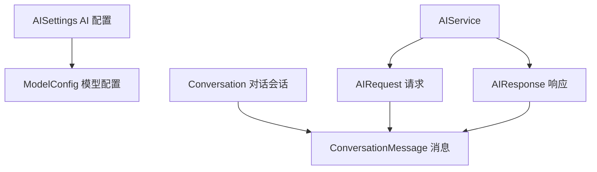
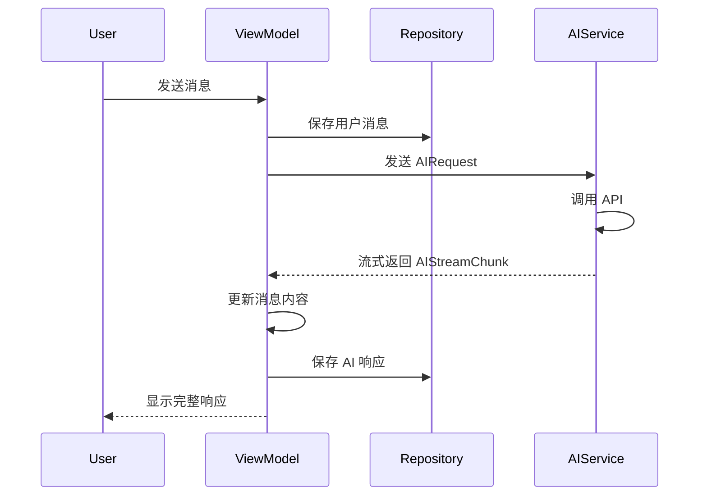

# AI 模型详解

> 返回 [文档中心](../INDEX.md) | [模型概览](models-overview.md)

## 概述

AI 模型定义了观己应用与 AI 服务交互的数据结构，包括对话管理、服务请求/响应、以及 AI 配置。支持多种 AI 模式（对话、思考、分析）和流式响应。

## 模型架构



## 对话模型

### Conversation (对话会话)

```swift
// 文件路径: Core/Models/AIConversationModels.swift
public struct Conversation: Codable, Identifiable {
    public let id: String
    public var title: String
    public var messages: [ConversationMessage]
    public var mode: ConversationMode
    public var createdAt: Date
    public var updatedAt: Date
}

public enum ConversationMode: String, Codable {
    case chat      // 对话模式
    case thinking  // 思考模式
    case analysis  // 分析模式
}
```

**字段说明**:
- `title`: 对话标题（自动生成或用户设置）
- `messages`: 消息列表
- `mode`: 对话模式，影响 AI 的回复风格
- `createdAt/updatedAt`: 时间戳

### ConversationMessage (对话消息)

```swift
public struct ConversationMessage: Codable, Identifiable {
    public let id: String
    public let role: MessageRole
    public var content: String
    public var richContent: RichContent?
    public var timestamp: Date
    public var status: MessageStatus
    public var thinkingProcess: String?
}

public enum MessageRole: String, Codable {
    case user      // 用户消息
    case assistant // AI 助手消息
    case system    // 系统消息
}

public enum MessageStatus: String, Codable {
    case sending    // 发送中
    case sent       // 已发送
    case streaming  // 流式接收中
    case completed  // 已完成
    case failed     // 失败
}
```

**富内容结构**:
```swift
public struct RichContent: Codable {
    public var blocks: [ContentBlock]
    
    public enum ContentBlock: Codable {
        case text(String)
        case code(language: String, code: String)
        case list(items: [String])
        case table(headers: [String], rows: [[String]])
        case quote(String)
    }
}
```

**思考过程**:
- `thinkingProcess`: AI 的思考过程（仅在思考模式下）
- 用于展示 AI 的推理步骤
- 可折叠显示

## 服务模型

### AIRequest (AI 请求)

```swift
// 文件路径: Core/Models/AIServiceModels.swift
public struct AIRequest: Codable {
    public let messages: [ConversationMessage]
    public let model: String
    public let temperature: Double
    public let maxTokens: Int?
    public let stream: Bool
    public let systemPrompt: String?
}
```

**字段说明**:
- `messages`: 对话历史（包含上下文）
- `model`: 使用的模型名称（如 "gpt-4"）
- `temperature`: 温度参数（0.0-2.0），控制随机性
- `maxTokens`: 最大生成 token 数
- `stream`: 是否使用流式响应
- `systemPrompt`: 系统提示词（定义 AI 角色）

### AIResponse (AI 响应)

```swift
public struct AIResponse: Codable {
    public let id: String
    public let content: String
    public let finishReason: FinishReason?
    public let usage: TokenUsage?
    public let thinkingProcess: String?
}

public enum FinishReason: String, Codable {
    case stop          // 正常结束
    case length        // 达到长度限制
    case contentFilter // 内容过滤
}

public struct TokenUsage: Codable {
    public let promptTokens: Int
    public let completionTokens: Int
    public let totalTokens: Int
}
```

**流式响应**:
```swift
public struct AIStreamChunk: Codable {
    public let delta: String      // 增量内容
    public let isComplete: Bool   // 是否完成
}
```

## 配置模型

### AISettings (AI 配置)

```swift
// 文件路径: Core/Models/AISettingsModels.swift
public struct AISettings: Codable, Identifiable {
    public let id: String
    public var provider: AIProvider
    public var apiKey: String?
    public var baseURL: String?
    public var defaultModel: String
    public var temperature: Double
    public var maxTokens: Int
    public var enableThinking: Bool
    public var systemPrompt: String?
    public var createdAt: Date
    public var updatedAt: Date
}

public enum AIProvider: String, Codable {
    case openai     // OpenAI
    case anthropic  // Anthropic (Claude)
    case local      // 本地模型
    case custom     // 自定义
}
```

**默认值**:
```swift
public static let defaultSettings = AISettings(
    id: "default",
    provider: .openai,
    apiKey: nil,
    baseURL: nil,
    defaultModel: "gpt-4",
    temperature: 0.7,
    maxTokens: 2000,
    enableThinking: false,
    systemPrompt: "你是一个善于倾听和思考的 AI 助手。",
    createdAt: Date(),
    updatedAt: Date()
)
```

### ModelConfig (模型配置)

```swift
public struct ModelConfig: Codable, Identifiable {
    public let id: String
    public let name: String
    public let displayName: String
    public let provider: AIProvider
    public let contextWindow: Int
    public let supportStreaming: Bool
    public let supportThinking: Bool
    public let costPer1kTokens: Double?
}
```

**预设模型配置**:
```swift
public static let availableModels: [ModelConfig] = [
    ModelConfig(
        id: "gpt-4",
        name: "gpt-4",
        displayName: "GPT-4",
        provider: .openai,
        contextWindow: 8192,
        supportStreaming: true,
        supportThinking: false,
        costPer1kTokens: 0.03
    ),
    ModelConfig(
        id: "claude-3-opus",
        name: "claude-3-opus-20240229",
        displayName: "Claude 3 Opus",
        provider: .anthropic,
        contextWindow: 200000,
        supportStreaming: true,
        supportThinking: true,
        costPer1kTokens: 0.015
    )
]
```

## 对话模式详解

### Chat Mode (对话模式)

**特点**:
- 快速响应
- 简洁回答
- 适合日常对话

**系统提示词示例**:
```
你是一个友好的 AI 助手，善于倾听用户的想法和感受。
请用简洁、温暖的语言回复用户。
```

### Thinking Mode (思考模式)

**特点**:
- 展示思考过程
- 深度分析
- 适合复杂问题

**系统提示词示例**:
```
你是一个深度思考的 AI 助手。
在回答前，请先展示你的思考过程，包括：
1. 问题分析
2. 可能的角度
3. 推理步骤
然后给出你的回答。
```

**响应格式**:
```
<thinking>
用户询问了关于时间管理的问题。
我需要考虑：
1. 用户的具体场景
2. 常见的时间管理方法
3. 个性化建议
</thinking>

<answer>
基于你的情况，我建议...
</answer>
```

### Analysis Mode (分析模式)

**特点**:
- 数据驱动
- 结构化输出
- 适合日记分析

**系统提示词示例**:
```
你是一个数据分析专家，擅长从日记中提取洞察。
请分析用户的日记，提供：
1. 情绪趋势
2. 行为模式
3. 建议
```

## 使用示例

### 创建对话

```swift
let conversation = Conversation(
    id: UUID().uuidString,
    title: "关于时间管理的讨论",
    messages: [],
    mode: .chat,
    createdAt: Date(),
    updatedAt: Date()
)
```

### 发送消息

```swift
let userMessage = ConversationMessage(
    id: UUID().uuidString,
    role: .user,
    content: "如何更好地管理时间？",
    richContent: nil,
    timestamp: Date(),
    status: .sent,
    thinkingProcess: nil
)

let request = AIRequest(
    messages: [userMessage],
    model: "gpt-4",
    temperature: 0.7,
    maxTokens: 2000,
    stream: true,
    systemPrompt: "你是一个友好的 AI 助手。"
)
```

### 处理响应

```swift
let response = AIResponse(
    id: UUID().uuidString,
    content: "时间管理的关键是...",
    finishReason: .stop,
    usage: TokenUsage(
        promptTokens: 50,
        completionTokens: 200,
        totalTokens: 250
    ),
    thinkingProcess: nil
)

let assistantMessage = ConversationMessage(
    id: response.id,
    role: .assistant,
    content: response.content,
    richContent: nil,
    timestamp: Date(),
    status: .completed,
    thinkingProcess: response.thinkingProcess
)
```

### 流式响应处理

```swift
func handleStreamChunk(_ chunk: AIStreamChunk) {
    if chunk.isComplete {
        // 更新消息状态为完成
        message.status = .completed
    } else {
        // 追加增量内容
        message.content += chunk.delta
        message.status = .streaming
    }
}
```

## 数据流程

### 对话流程



## 相关文档

- [模型概览](models-overview.md)
- [AIService](../api/services.md#aiservice)
- [AIConversationRepository](../api/repositories.md#aiconversationrepository)
- [AI 对话功能文档](../features/ai-conversation.md)

---
**版本**: v1.0.0  
**作者**: Kiro AI Assistant  
**更新日期**: 2024-12-17  
**状态**: 已发布
