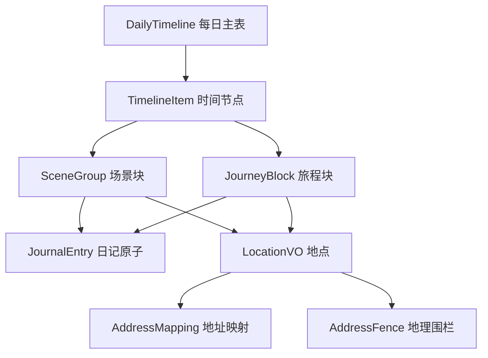

# 数据模型概览

> 返回 [文档中心](../INDEX.md)

## 概述

本文档提供观己应用所有数据模型的概览。所有模型位于 `Core/Models` 目录，采用 Swift 结构体和枚举定义，支持 Codable 协议以实现 JSON 序列化。

## 模型分类

### 时间轴相关模型 (Timeline Models)

| 模型文件 | 主要类型 | 职责 |
|---------|---------|------|
| `DailyTimeline.swift` | `DailyTimeline` | 每日主表，包含场景和旅程的时间节点 |
| `JournalEntry.swift` | `JournalEntry`, `ContentBlock` | 日记原子，最小记录单元 |
| `LocationModel.swift` | `LocationVO`, `SceneGroup`, `JourneyBlock`, `TimelineItem` | 地点、场景块、旅程块的数据结构 |
| `TimelinePersistenceModels.swift` | 持久化相关类型 | 时间轴数据的存储和加载 |

### AI 相关模型 (AI Models)

| 模型文件 | 主要类型 | 职责 |
|---------|---------|------|
| `AIConversationModels.swift` | `Conversation`, `ConversationMessage` | AI 对话会话和消息 |
| `AIServiceModels.swift` | `AIRequest`, `AIResponse` | AI 服务请求和响应 |
| `AISettingsModels.swift` | `AISettings`, `ModelConfig` | AI 配置和模型参数 |

### 用户画像模型 (Profile Models)

| 模型文件 | 主要类型 | 职责 |
|---------|---------|------|
| `UserProfileModels.swift` | `UserProfile` | 用户基础信息 |
| `RelationshipProfileModels.swift` | `RelationshipProfile` | 关系画像（旧版） |
| `NarrativeProfileModels.swift` | `NarrativeUserProfile` | 叙事用户画像（新版） |
| `NarrativeRelationshipModels.swift` | `NarrativeRelationship` | 叙事关系画像（新版） |

### 追踪器模型 (Tracker Models)

| 模型文件 | 主要类型 | 职责 |
|---------|---------|------|
| `DailyTrackerModels.swift` | `DailyTrackerRecord`, `TrackerContext` | 每日追踪记录和上下文 |
| `MindStateModels.swift` | `MindStateConfig` | 心境配置 |
| `MindStateRecord.swift` | `MindStateRecord` | 心境记录 |

### 辅助模型 (Auxiliary Models)

| 模型文件 | 主要类型 | 职责 |
|---------|---------|------|
| `AuxiliaryModels.swift` | `QuestionEntry`, `LoveLog`, `UserAchievement`, `DayRecord` | 时间胶囊、爱的记录、成就、历史记录 |
| `MemoryLayerModels.swift` | 记忆层相关类型 | 记忆层数据结构 |
| `NormalizedDataModels.swift` | 标准化数据类型 | 数据标准化和转换 |
| `ResonanceDateStat.swift` | `ResonanceDateStat` | 共鸣日期统计 |
| `SystemPermission.swift` | `SystemPermission` | 系统权限状态 |

## 核心枚举类型

### EntryType (日记类型)
```swift
public enum EntryType: String, Codable {
    case text      // 文本
    case image     // 图片
    case video     // 视频
    case audio     // 音频
    case file      // 文件
    case mixed     // 混合
}
```

### EntryCategory (日记分类)
```swift
public enum EntryCategory: String, Codable {
    case dream     // 梦想
    case health    // 健康
    case emotion   // 情绪
    case work      // 工作
    case social    // 社交
    case media     // 媒体
    case life      // 生活
}
```

### EntryChronology (时间维度)
```swift
public enum EntryChronology: String, Codable {
    case past      // 过去
    case present   // 现在
    case future    // 未来
}
```

### LocationStatus (地点状态)
```swift
public enum LocationStatus: String, Codable {
    case no_permission  // 无权限
    case raw           // 原始地址
    case mapped        // 已映射
}
```

## 数据关系



## 持久化策略

所有模型均实现 `Codable` 协议，支持：
- JSON 序列化/反序列化
- 文件系统存储（Documents 目录）
- 内存缓存 + 异步写入
- Repository 模式访问

## 相关文档

- [时间轴模型详解](timeline-models.md)
- [用户画像模型详解](user-profile-models.md)
- [AI 模型详解](ai-models.md)
- [追踪器模型详解](tracker-models.md)
- [数据架构文档](../architecture/data-architecture.md)

---
**版本**: v1.0.0  
**作者**: Kiro AI Assistant  
**更新日期**: 2024-12-17  
**状态**: 已发布
