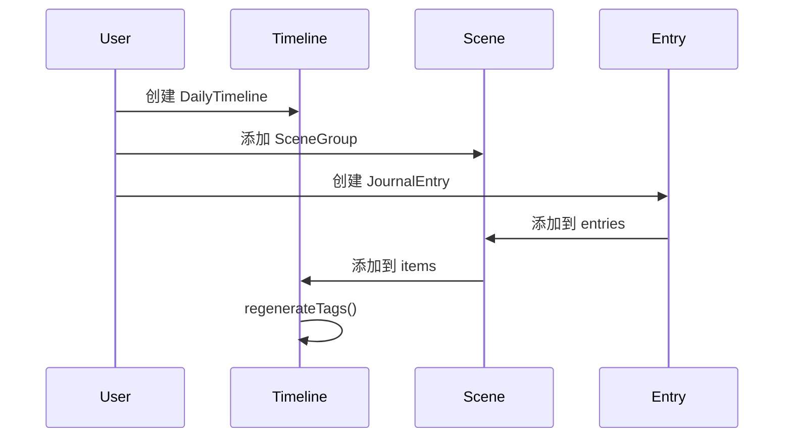
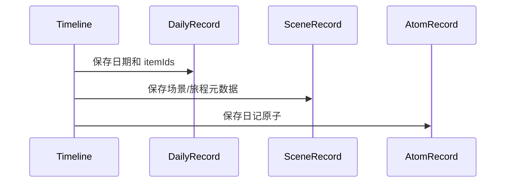
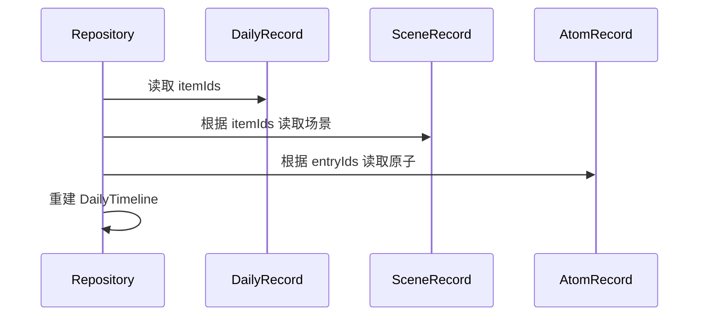

# 时间轴模型详解

> 返回 [文档中心](../INDEX.md) | [模型概览](models-overview.md)

## 概述

时间轴模型是观己应用的核心数据结构，采用三层架构设计：每日主表 (DailyTimeline) → 时间节点 (TimelineItem) → 日记原子 (JournalEntry)。这种设计支持灵活的时间线组织和高效的数据持久化。

## 核心模型

### DailyTimeline (每日主表)

每日主表是某一天所有记录的容器，包含场景块和旅程块的集合。

```swift
// 文件路径: Core/Models/DailyTimeline.swift
public struct DailyTimeline: Codable, Identifiable {
    public let id: String              // 格式: day_YYYYMMDD
    public let date: String            // 格式: yyyy.MM.dd
    public var weather: String?        // 天气描述
    public let createdAt: Date         // 创建时间
    public var updatedAt: Date         // 更新时间
    public var title: String?          // 标题
    public var items: [TimelineItem]   // 时间节点（场景/旅程）
    public var tags: [EntryCategory]   // 日记分类标签
}
```

**职责**:
- 作为某一天的主索引
- 管理场景块和旅程块的顺序
- 聚合当天所有日记的分类标签
- 提供天气、标题等元数据

**关键方法**:
```swift
public mutating func regenerateTags()
```
重新计算当天所有日记的分类标签，去重后更新 `tags` 字段。

### JournalEntry (日记原子)

日记原子是最小的记录单元，可以是文本、图片、视频、音频等多种类型。

```swift
// 文件路径: Core/Models/JournalEntry.swift
public struct JournalEntry: Codable, Identifiable {
    public let id: String
    public let type: EntryType              // 类型: text/image/video/audio/file/mixed
    public let subType: EntrySubType?       // 子类型: love_received/pending_question/normal
    public let chronology: EntryChronology  // 时间维度: past/present/future
    public let content: String?             // 文本内容
    public let url: String?                 // 媒体 URL
    public let timestamp: String            // 时间戳
    public let category: EntryCategory?     // 分类: dream/health/emotion/work/social/media/life
    public let metadata: Metadata?          // 元数据
}
```

**元数据结构**:
```swift
public struct Metadata: Codable {
    public let blocks: [ContentBlock]?   // 混合内容块
    public let reviewDate: String?       // 回顾日期（时间胶囊）
    public let createdDate: String?      // 创建日期
    public let questionId: String?       // 关联问题 ID
    public let duration: String?         // 时长（音频/视频）
    public let sender: String?           // 发送者（爱的记录）
}
```

**内容块**:
```swift
public struct ContentBlock: Codable, Identifiable {
    public let id: String
    public let type: EntryType
    public let content: String
    public let url: String?
    public let duration: String?
}
```

### TimelineItem (时间节点)

时间节点是场景块或旅程块的枚举类型，代表时间轴上的一个单元。

```swift
// 文件路径: Core/Models/LocationModel.swift
public enum TimelineItem: Codable, Identifiable {
    case scene(SceneGroup)      // 场景块
    case journey(JourneyBlock)  // 旅程块
    
    public var id: String {
        switch self {
        case .scene(let s): return s.id
        case .journey(let j): return j.id
        }
    }
}
```

#### SceneGroup (场景块)

场景块表示在某个地点停留的时间段及其相关日记。

```swift
public struct SceneGroup: Codable, Identifiable {
    public let type: String           // 固定为 "scene"
    public let id: String             // 唯一标识
    public let timeRange: String      // 时间范围，如 "09:00-12:00"
    public let location: LocationVO   // 地点信息
    public let entries: [JournalEntry] // 该场景下的日记
}
```

#### JourneyBlock (旅程块)

旅程块表示从一个地点到另一个地点的移动过程。

```swift
public struct JourneyBlock: Codable, Identifiable {
    public let type: String              // 固定为 "journey"
    public let id: String                // 唯一标识
    public let origin: LocationVO        // 起点
    public let destination: LocationVO   // 终点
    public let mode: TransportMode       // 交通方式: car/walk/subway/bicycle
    public let duration: String          // 时长
    public let entries: [JournalEntry]   // 旅程中的日记
}
```

## 持久化模型

为了优化存储和查询性能，时间轴采用分表存储策略。

### DailyTimelineRecord (每日索引表)

```swift
// 文件路径: Core/Models/TimelinePersistenceModels.swift
public struct DailyTimelineRecord: Codable {
    public let date: String        // 日期
    public let itemIds: [String]   // 场景/旅程 ID 列表
}
```

**用途**: 存储某一天的时间节点 ID 索引，避免加载完整数据。

### SceneRecord (场景/旅程记录表)

```swift
public struct SceneRecord: Codable {
    public let id: String
    public let type: String  // "scene" 或 "journey"
    
    // 场景字段
    public let timeRange: String?
    public let location: LocationVO?
    
    // 旅程字段
    public let duration: String?
    public let origin: LocationVO?
    public let destination: LocationVO?
    public let transportMode: TransportMode?
    
    // 日记原子引用
    public let entryIds: [String]
}
```

**用途**: 存储场景/旅程的元数据，通过 `entryIds` 引用日记原子。

**转换方法**:
```swift
// TimelineItem → SceneRecord
public init(from item: TimelineItem)

// SceneRecord → TimelineItem
public func toTimelineItem(entries: [JournalEntry]) -> TimelineItem?
```

### AtomRecord (原子记录表)

```swift
public typealias AtomRecord = JournalEntry
```

**用途**: 直接使用 `JournalEntry` 作为原子记录，存储在独立的原子表中。

## 数据流程

### 创建时间轴



### 持久化流程



### 加载流程



## 枚举类型

### EntryType (日记类型)

```swift
public enum EntryType: String, Codable {
    case text   // 文本
    case image  // 图片
    case video  // 视频
    case audio  // 音频
    case file   // 文件
    case mixed  // 混合（包含多个 ContentBlock）
}
```

### EntrySubType (日记子类型)

```swift
public enum EntrySubType: String, Codable {
    case love_received      // 爱的记录
    case pending_question   // 待回答的时间胶囊
    case normal            // 普通日记
}
```

### EntryChronology (时间维度)

```swift
public enum EntryChronology: String, Codable {
    case past     // 过去（回忆）
    case present  // 现在（当下记录）
    case future   // 未来（时间胶囊）
}
```

### EntryCategory (日记分类)

```swift
public enum EntryCategory: String, Codable {
    case dream    // 梦想
    case health   // 健康
    case emotion  // 情绪
    case work     // 工作
    case social   // 社交
    case media    // 媒体
    case life     // 生活
}
```

### TransportMode (交通方式)

```swift
public enum TransportMode: String, Codable {
    case car      // 汽车
    case walk     // 步行
    case subway   // 地铁
    case bicycle  // 自行车
}
```

## 使用示例

### 创建每日时间轴

```swift
// 创建日记原子
let entry = JournalEntry(
    id: UUID().uuidString,
    type: .text,
    subType: .normal,
    chronology: .present,
    content: "今天天气不错",
    url: nil,
    timestamp: ISO8601DateFormatter().string(from: Date()),
    category: .life,
    metadata: nil
)

// 创建场景块
let scene = SceneGroup(
    type: "scene",
    id: UUID().uuidString,
    timeRange: "09:00-12:00",
    location: locationVO,
    entries: [entry]
)

// 创建每日时间轴
var timeline = DailyTimeline(
    id: "day_20241217",
    date: "2024.12.17",
    weather: "晴",
    items: [.scene(scene)]
)

// 重新计算标签
timeline.regenerateTags()
```

## 相关文档

- [模型概览](models-overview.md)
- [地点模型详解](../architecture/data-architecture.md#地点模型)
- [TimelineRepository](../api/repositories.md#timelinerepository)
- [时间轴功能文档](../features/timeline.md)

---
**版本**: v1.0.0  
**作者**: Kiro AI Assistant  
**更新日期**: 2024-12-17  
**状态**: 已发布
