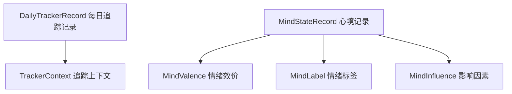
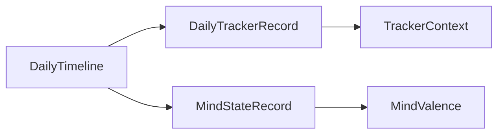
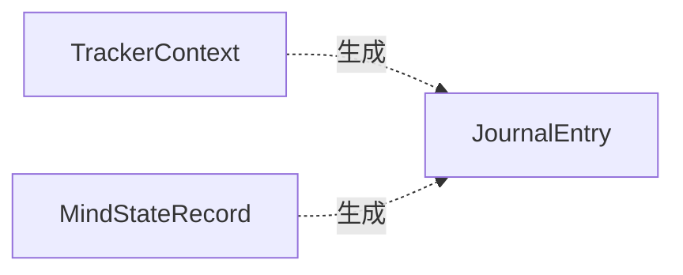

# 追踪器模型详解

> 返回 [文档中心](../INDEX.md) | [模型概览](models-overview.md)

## 概述

追踪器模型用于记录用户的日常状态和心境变化。包括每日追踪记录（活动、地点、人物）和心境记录（情绪、影响因素）。这些数据为 AI 分析和洞察提供基础。

## 模型架构



## 每日追踪模型

### DailyTrackerRecord (每日追踪记录)

```swift
// 文件路径: Core/Models/DailyTrackerModels.swift
public struct DailyTrackerRecord: Codable, Identifiable {
    public let id: String
    public let date: String              // 日期 (yyyy.MM.dd)
    public var contexts: [TrackerContext] // 追踪上下文列表
    public var summary: String?          // 当日摘要
    public var createdAt: Date
    public var updatedAt: Date
}
```

**字段说明**:
- `date`: 记录日期
- `contexts`: 当天的多个追踪上下文（活动、地点、人物）
- `summary`: AI 生成的当日摘要

### TrackerContext (追踪上下文)

```swift
public struct TrackerContext: Codable, Identifiable {
    public let id: String
    public let timestamp: Date
    public var activity: String?         // 活动内容
    public var location: String?         // 地点
    public var people: [String]          // 相关人物
    public var tags: [String]            // 标签
    public var notes: String?            // 备注
}
```

**使用场景**:
- 快速记录当前正在做什么
- 记录与谁在一起
- 标记活动类型（工作、社交、运动等）

**示例**:
```swift
let context = TrackerContext(
    id: UUID().uuidString,
    timestamp: Date(),
    activity: "与朋友喝咖啡",
    location: "星巴克",
    people: ["小明", "小红"],
    tags: ["社交", "咖啡"],
    notes: "讨论了最近的项目进展"
)
```

## 心境模型

### MindStateRecord (心境记录)

```swift
// 文件路径: Core/Models/MindStateRecord.swift
public struct MindStateRecord: Codable, Identifiable {
    public let id: String
    public let date: String              // 日期
    public let valenceValue: Int         // 情绪效价值 (0-6)
    public let labels: [String]          // 情绪标签
    public let influences: [String]      // 影响因素
    public let createdAt: Date
}
```

**字段说明**:
- `valenceValue`: 情绪效价值，范围 0-6（非常不愉快到非常愉快）
- `labels`: 具体的情绪标签（如 "happy", "anxious"）
- `influences`: 影响情绪的因素（如 "work", "health"）

### MindValence (情绪效价)

情绪效价表示情绪的愉悦程度，采用 7 级量表。

```swift
// 文件路径: Core/Models/MindStateModels.swift
public enum MindValence: Int, CaseIterable {
    case veryUnpleasant = 0      // 非常不愉快
    case unpleasant = 1          // 不愉快
    case slightlyUnpleasant = 2  // 略微不愉快
    case neutral = 3             // 中性
    case slightlyPleasant = 4    // 略微愉快
    case pleasant = 5            // 愉快
    case veryPleasant = 6        // 非常愉快
}
```

**视觉映射**:

| 效价值 | 图标 | 颜色 | 描述 |
|-------|------|------|------|
| 0 | cloud.heavyrain.fill | slateDark | 非常不愉快（暴雨） |
| 1 | cloud.rain.fill | indigo | 不愉快（雨天） |
| 2 | cloud.drizzle.fill | sky | 略微不愉快（小雨） |
| 3 | cloud.fill | slateLight | 中性（阴天） |
| 4 | cloud.sun.fill | teal | 略微愉快（多云转晴） |
| 5 | sun.min.fill | orange | 愉快（晴天） |
| 6 | sun.max.fill | amber | 非常愉快（艳阳天） |

### MindLabel (情绪标签)

情绪标签描述具体的情绪状态，按效价分组。

```swift
public struct MindLabel: Hashable, Identifiable {
    public let id: String
    public let key: String              // 本地化 key
    public let group: MindValenceGroup  // 所属分组
}

public enum MindValenceGroup: String, CaseIterable {
    case unpleasant  // 不愉快
    case neutral     // 中性
    case pleasant    // 愉快
}
```

**预设标签**:

**不愉快标签** (Unpleasant):
- angry (愤怒), anxious (焦虑), ashamed (羞愧)
- disappointed (失望), discouraged (沮丧), disgusted (厌恶)
- embarrassed (尴尬), frustrated (挫败), guilty (内疚)
- hopeless (绝望), irritated (烦躁), jealous (嫉妒)
- lonely (孤独), sad (悲伤), scared (害怕)
- stressed (压力), worried (担忧), annoyed (恼怒)
- drained (疲惫), overwhelmed (不知所措)

**中性标签** (Neutral):
- calm (平静), content (满足), indifferent (无所谓)
- peaceful (安宁), satisfied (满意)

**愉快标签** (Pleasant):
- amazed (惊喜), amused (愉悦), brave (勇敢)
- confident (自信), excited (兴奋), grateful (感恩)
- happy (快乐), hopeful (充满希望), joyful (喜悦)
- passionate (热情), proud (自豪), relieved (释然)
- surprised (惊讶)

### MindInfluence (影响因素)

影响因素表示影响情绪的生活领域。

```swift
public enum MindInfluence: String, CaseIterable {
    case work          // 工作
    case family        // 家庭
    case money         // 财务
    case health        // 健康
    case spirituality  // 精神/信仰
    case tasks         // 任务/待办
    case weather       // 天气
    case dating        // 约会
    case community     // 社区
    case education     // 教育
    case friends       // 朋友
    case relationships // 人际关系
    case identity      // 自我认同
    case partner       // 伴侣
    case social        // 社交
    case home          // 家居
    case fitness       // 健身
}
```

## 数据关系

### 追踪记录与时间轴



- 每日时间轴可以关联每日追踪记录
- 每日时间轴可以关联心境记录
- 追踪记录和心境记录相互独立，但可以交叉分析

### 追踪记录与日记



- 追踪上下文可以转换为日记原子
- 心境记录可以生成心境日记

## 使用示例

### 创建每日追踪记录

```swift
let context1 = TrackerContext(
    id: UUID().uuidString,
    timestamp: Date(),
    activity: "晨跑",
    location: "公园",
    people: [],
    tags: ["运动", "健康"],
    notes: "跑了 5 公里，感觉很好"
)

let context2 = TrackerContext(
    id: UUID().uuidString,
    timestamp: Date().addingTimeInterval(3600 * 3),
    activity: "团队会议",
    location: "办公室",
    people: ["张三", "李四"],
    tags: ["工作", "会议"],
    notes: "讨论了新项目的方案"
)

let record = DailyTrackerRecord(
    id: UUID().uuidString,
    date: "2024.12.17",
    contexts: [context1, context2],
    summary: "今天运动和工作都很充实",
    createdAt: Date(),
    updatedAt: Date()
)
```

### 创建心境记录

```swift
let mindState = MindStateRecord(
    id: UUID().uuidString,
    date: "2024.12.17",
    valenceValue: 5,  // pleasant
    labels: ["happy", "confident", "grateful"],
    influences: ["work", "friends", "health"],
    createdAt: Date()
)
```

### 查询情绪趋势

```swift
// 获取最近 7 天的心境记录
let recentMindStates = repository.getMindStates(
    from: Date().addingTimeInterval(-7 * 24 * 3600),
    to: Date()
)

// 计算平均效价值
let averageValence = recentMindStates
    .map { $0.valenceValue }
    .reduce(0, +) / recentMindStates.count

// 统计最常见的情绪标签
let labelCounts = recentMindStates
    .flatMap { $0.labels }
    .reduce(into: [:]) { counts, label in
        counts[label, default: 0] += 1
    }
```

## 数据分析

### 情绪趋势分析

```swift
// 按周统计平均效价值
func weeklyValenceTrend(records: [MindStateRecord]) -> [Double] {
    // 按周分组
    let grouped = Dictionary(grouping: records) { record in
        // 计算周数
        Calendar.current.component(.weekOfYear, from: record.createdAt)
    }
    
    // 计算每周平均值
    return grouped.values.map { weekRecords in
        let sum = weekRecords.map { $0.valenceValue }.reduce(0, +)
        return Double(sum) / Double(weekRecords.count)
    }
}
```

### 影响因素分析

```swift
// 分析哪些因素最影响情绪
func topInfluences(records: [MindStateRecord]) -> [(String, Int)] {
    let counts = records
        .flatMap { $0.influences }
        .reduce(into: [:]) { counts, influence in
            counts[influence, default: 0] += 1
        }
    
    return counts.sorted { $0.value > $1.value }
}
```

## 相关文档

- [模型概览](models-overview.md)
- [DailyTrackerRepository](../api/repositories.md#dailytrackerrepository)
- [MindStateRepository](../api/repositories.md#mindstaterepository)
- [每日追踪功能文档](../features/daily-tracker.md)
- [心境记录功能文档](../features/mind-state.md)

---
**版本**: v1.0.0  
**作者**: Kiro AI Assistant  
**更新日期**: 2024-12-17  
**状态**: 已发布
