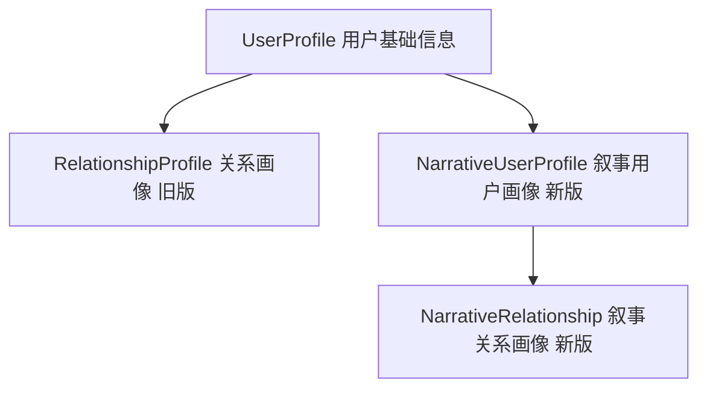
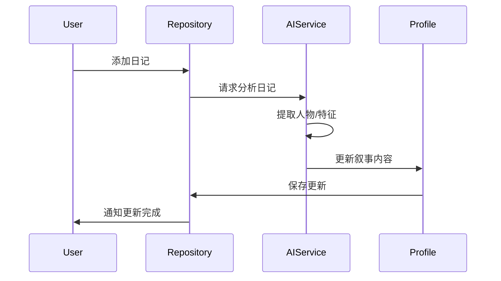

# 用户画像模型详解

> 返回 [文档中心](../INDEX.md) | [模型概览](models-overview.md)

## 概述

用户画像模型用于描述用户自身和用户关系的特征。观己采用双版本设计：旧版基于结构化字段，新版（叙事版）基于 AI 生成的自然语言描述。两个版本并存，支持平滑迁移。

## 模型架构



## 旧版模型 (结构化)

### UserProfile (用户基础信息)

```swift
// 文件路径: Core/Models/UserProfileModels.swift
public struct UserProfile: Codable, Identifiable {
    public let id: String
    public var name: String
    public var avatar: String?
    public var bio: String?
    public var interests: [String]
    public var values: [String]
    public var goals: [String]
    public var createdAt: Date
    public var updatedAt: Date
}
```

**字段说明**:
- `name`: 用户姓名
- `avatar`: 头像 URL
- `bio`: 个人简介
- `interests`: 兴趣爱好列表
- `values`: 价值观列表
- `goals`: 目标列表

### RelationshipProfile (关系画像 - 旧版)

```swift
// 文件路径: Core/Models/RelationshipProfileModels.swift
public struct RelationshipProfile: Codable, Identifiable {
    public let id: String
    public var name: String
    public var relationship: String        // 关系类型：朋友、家人、同事等
    public var avatar: String?
    public var notes: String?              // 备注
    public var traits: [String]            // 性格特征
    public var sharedInterests: [String]   // 共同兴趣
    public var importantDates: [ImportantDate]  // 重要日期
    public var createdAt: Date
    public var updatedAt: Date
}

public struct ImportantDate: Codable, Identifiable {
    public let id: String
    public let name: String      // 如 "生日"、"纪念日"
    public let date: String      // 日期字符串
    public let recurring: Bool   // 是否每年重复
}
```

**特点**:
- 结构化字段，易于编辑和查询
- 支持重要日期提醒
- 适合快速录入和展示

## 新版模型 (叙事版)

### NarrativeUserProfile (叙事用户画像)

```swift
// 文件路径: Core/Models/NarrativeProfileModels.swift
public struct NarrativeUserProfile: Codable, Identifiable {
    public let id: String
    public var name: String
    public var avatar: String?
    
    // 叙事内容（AI 生成）
    public var narrative: String?           // 完整叙事文本
    public var summary: String?             // 摘要
    public var keyTraits: [String]          // 关键特征标签
    
    // 元数据
    public var lastUpdatedBy: String?       // 最后更新来源（AI/用户）
    public var confidence: Double?          // AI 生成的置信度
    public var sourceEntryIds: [String]     // 来源日记 ID
    
    public var createdAt: Date
    public var updatedAt: Date
}
```

**叙事内容示例**:
```
你是一个热爱探索的人，喜欢在周末去不同的咖啡馆工作。
你重视与朋友的深度交流，经常在晚上与他们分享生活感悟。
你对健康生活方式有持续的追求，每天早上会进行冥想和运动。
```

**特点**:
- 自然语言描述，更贴近人类思维
- AI 自动从日记中提取和生成
- 包含置信度和来源追溯

### NarrativeRelationship (叙事关系画像)

```swift
// 文件路径: Core/Models/NarrativeRelationshipModels.swift
public struct NarrativeRelationship: Codable, Identifiable {
    public let id: String
    public var name: String
    public var avatar: String?
    public var relationshipType: String?    // 关系类型
    
    // 叙事内容（AI 生成）
    public var narrative: String?           // 关系叙事
    public var summary: String?             // 关系摘要
    public var keyMoments: [KeyMoment]      // 关键时刻
    public var interactionPatterns: String? // 互动模式描述
    
    // 元数据
    public var lastUpdatedBy: String?
    public var confidence: Double?
    public var sourceEntryIds: [String]
    
    public var createdAt: Date
    public var updatedAt: Date
}

public struct KeyMoment: Codable, Identifiable {
    public let id: String
    public let date: String
    public let description: String
    public let entryId: String?  // 关联的日记 ID
}
```

**叙事内容示例**:
```
你和小明是大学时期的好友，经常一起讨论技术和创业想法。
你们的友谊建立在相互尊重和共同成长的基础上。
最近你们开始每周进行一次深度对话，分享各自的思考和困惑。
```

**关键时刻示例**:
- 2024.03.15: 一起参加技术分享会，讨论了 AI 的未来
- 2024.06.20: 深夜长谈，分享了各自的人生目标
- 2024.09.10: 一起完成了一个开源项目

## 版本对比

| 特性 | 旧版（结构化） | 新版（叙事版） |
|------|--------------|--------------|
| 数据形式 | 结构化字段 | 自然语言 + 标签 |
| 生成方式 | 用户手动输入 | AI 自动生成 |
| 可读性 | 列表形式 | 连贯叙事 |
| 可编辑性 | 易于编辑 | 需要 AI 辅助 |
| 信息密度 | 较低 | 较高 |
| 来源追溯 | 无 | 有（sourceEntryIds） |
| 置信度 | 无 | 有（confidence） |

## 迁移策略

### 从旧版到新版

```swift
// 概念性迁移流程
func migrateToNarrative(oldProfile: UserProfile) -> NarrativeUserProfile {
    // 1. 保留基础信息
    var narrative = NarrativeUserProfile(
        id: oldProfile.id,
        name: oldProfile.name,
        avatar: oldProfile.avatar
    )
    
    // 2. 将结构化字段转换为叙事
    let interests = oldProfile.interests.joined(separator: "、")
    let values = oldProfile.values.joined(separator: "、")
    narrative.narrative = """
    你的兴趣包括：\(interests)。
    你重视的价值观有：\(values)。
    """
    
    // 3. 提取关键特征
    narrative.keyTraits = oldProfile.interests + oldProfile.values
    
    return narrative
}
```

### 双版本并存

- 旧版数据保留，不删除
- 新版数据逐步生成
- UI 优先展示新版，降级到旧版
- 用户可选择使用哪个版本

## 数据更新机制

### 自动更新触发条件

1. **新增日记**: 当用户添加包含人物或自我反思的日记时
2. **定期更新**: 每周自动分析最近的日记，更新画像
3. **手动触发**: 用户在画像页面点击"更新画像"

### 更新流程



## 使用示例

### 创建叙事用户画像

```swift
let profile = NarrativeUserProfile(
    id: UUID().uuidString,
    name: "张三",
    avatar: nil,
    narrative: "你是一个热爱学习的人...",
    summary: "热爱学习、注重健康、重视友谊",
    keyTraits: ["好奇心强", "自律", "善于倾听"],
    lastUpdatedBy: "AI",
    confidence: 0.85,
    sourceEntryIds: ["entry_001", "entry_002"],
    createdAt: Date(),
    updatedAt: Date()
)
```

### 创建叙事关系画像

```swift
let relationship = NarrativeRelationship(
    id: UUID().uuidString,
    name: "小明",
    avatar: nil,
    relationshipType: "好友",
    narrative: "你和小明是大学时期的好友...",
    summary: "技术伙伴、互相支持、共同成长",
    keyMoments: [
        KeyMoment(
            id: UUID().uuidString,
            date: "2024.03.15",
            description: "一起参加技术分享会",
            entryId: "entry_123"
        )
    ],
    interactionPatterns: "每周深度对话，分享技术见解",
    lastUpdatedBy: "AI",
    confidence: 0.90,
    sourceEntryIds: ["entry_123", "entry_456"],
    createdAt: Date(),
    updatedAt: Date()
)
```

## 相关文档

- [模型概览](models-overview.md)
- [ProfileMigrationService](../api/services.md#profilemigrationservice)
- [NarrativeUserProfileRepository](../api/repositories.md#narrativeuserprofilerepository)
- [个人中心功能文档](../features/profile.md)

---
**版本**: v1.0.0  
**作者**: Kiro AI Assistant  
**更新日期**: 2024-12-17  
**状态**: 已发布
