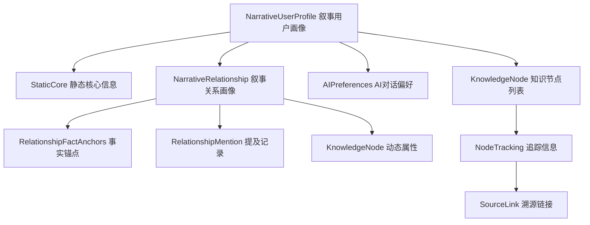
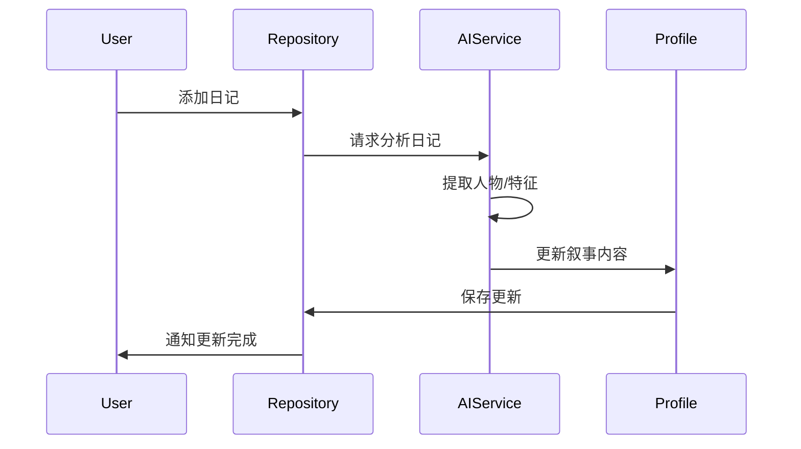

# 用户画像模型详解

> 返回 [文档中心](../INDEX.md) | [模型概览](models-overview.md)

## ⚠️ 重要更新 (2024-12-22)

**L4 扩展已实现**: 用户画像和关系画像已扩展支持**通用知识节点 (KnowledgeNode)**，可存储技能、价值观、目标、关系状态等动态维度。

**新增模型文件**:
- `KnowledgeNodeModels.swift` - 通用知识节点及相关类型
- `AIPreferencesModels.swift` - AI 对话偏好设置

## 概述

用户画像模型用于描述用户自身和用户关系的特征。观己采用**叙事版设计 + 通用知识节点**：
- **静态核心 (StaticCore)**: 用户手动维护的基础信息
- **知识节点 (KnowledgeNode)**: 动态的技能、价值观、目标等维度
- **AI 偏好 (AIPreferences)**: 用户与 AI 交互的偏好设置
- **事实锚点 (FactAnchors)**: 可验证的客观事实

## 模型架构



## 当前模型 (叙事版 + 知识节点)

### NarrativeUserProfile (叙事用户画像)

```swift
// 文件路径: Core/Models/NarrativeProfileModels.swift
public struct NarrativeUserProfile: Codable, Identifiable {
    public let id: String
    public let createdAt: Date
    public var updatedAt: Date
    
    // Static core (rarely changes)
    public var staticCore: StaticCore
    
    // Recent portrait (AI generated, updates periodically)
    public var recentPortrait: RecentPortrait?
    
    // 🆕 Dynamic knowledge nodes (L4 expansion)
    public var knowledgeNodes: [KnowledgeNode]
    
    // 🆕 AI conversation preferences
    public var aiPreferences: AIPreferences?
    
    // Relationship IDs
    public var relationshipIds: [String]
}

public struct StaticCore: Codable {
    // Basic identity
    public var gender: Gender?
    public var birthYearMonth: String?
    public var hometown: String?
    public var currentCity: String?
    
    // Career
    public var occupation: String?
    public var industry: String?
    public var education: Education?
    
    // Self tags
    public var selfTags: [String]
    
    // Update history
    public var updateHistory: [ProfileUpdateRecord]
}
```

### KnowledgeNode (通用知识节点) 🆕

```swift
// 文件路径: Core/Models/KnowledgeNodeModels.swift
public struct KnowledgeNode: Codable, Identifiable {
    public let id: String
    public let nodeType: String           // "skill", "value", "goal", etc.
    public let nodeCategory: NodeCategory // common | personal
    
    public var name: String               // "Swift 编程", "家庭优先"
    public var description: String?
    public var tags: [String]
    
    public var attributes: [String: AttributeValue]  // 动态属性
    public var tracking: NodeTracking                // 来源、置信度、历史
    public var relations: [NodeRelation]             // 节点关联
    
    public let createdAt: Date
    public var updatedAt: Date
}

// 节点分类
public enum NodeCategory: String, Codable {
    case common     // 共有维度：系统预定义
    case personal   // 个人独特：用户/AI 创建
}

// 属性值类型
public enum AttributeValue: Codable, Equatable {
    case string(String)
    case int(Int)
    case double(Double)
    case bool(Bool)
    case array([String])
    case date(Date)
}
```

**用户画像常用 nodeType**:
| nodeType | 中文名 | 说明 | 示例 |
|----------|--------|------|------|
| `skill` | 技能 | 用户掌握的技能 | Swift 编程 (advanced) |
| `value` | 价值观 | 核心价值观 | 家庭优先 (critical) |
| `hobby` | 兴趣爱好 | 业余爱好 | 摄影 (weekly) |
| `goal` | 目标 | 人生目标 | 学会日语 (in_progress) |
| `trait` | 性格特质 | 性格特征 | 内向 (strong) |
| `fear` | 恐惧担忧 | 焦虑点 | 公开演讲 (moderate) |
| `fact` | 核心事实 | 不容篡改的事实 | 2020年结婚 |
| `lifestyle` | 生活方式 | 生活习惯 | 早起跑步 (daily) |
| `belief` | 信念 | 人生信念 | 努力必有回报 |
| `preference` | 偏好 | 各类偏好 | 喜欢安静环境工作 |

### NodeTracking (追踪信息)

```swift
public struct NodeTracking: Codable {
    public var source: NodeSource         // 来源信息
    public var timeline: NodeTimeline     // 时间线
    public var verification: NodeVerification  // 确认状态
    public var changeHistory: [NodeChange]     // 变化历史
}

public struct NodeSource: Codable {
    public var type: SourceType           // userInput | aiExtracted | aiInferred
    public var confidence: Double?        // 0.0 ~ 1.0
    public var extractedFrom: [SourceLink]
}

public struct SourceLink: Codable, Identifiable {
    public let id: String
    public var sourceType: String         // diary | conversation | tracker
    public var sourceId: String           // 原始记录 ID
    public var dayId: String              // YYYY-MM-DD
    public var snippet: String?           // 相关文本片段
    public var extractedAt: Date
}
```

### AIPreferences (AI 对话偏好) 🆕

```swift
// 文件路径: Core/Models/AIPreferencesModels.swift
public struct AIPreferences: Codable {
    public var style: AIStylePreference      // 风格偏好
    public var response: AIResponsePreference // 回复偏好
    public var topics: AITopicPreference     // 话题偏好
    public var tracking: NodeTracking
}

public struct AIStylePreference: Codable {
    public var tone: AITone?              // formal | casual | friendly | professional
    public var verbosity: AIVerbosity?    // concise | balanced | detailed
    public var personality: AIPersonality? // supportive | challenging | neutral
}

public struct AITopicPreference: Codable {
    public var favorites: [String]        // 喜欢讨论的话题
    public var avoid: [String]            // 避免的话题
    public var expertise: [String]        // 用户擅长的领域
}
```

### NarrativeRelationship (叙事关系画像)

```swift
// 文件路径: Core/Models/NarrativeRelationshipModels.swift
public struct NarrativeRelationship: Codable, Identifiable {
    public let id: String
    public let createdAt: Date
    public var updatedAt: Date
    
    // Basic identity
    public var type: CompanionType
    public var displayName: String
    public var realName: String?            // Optional, encrypted
    public var avatar: String?              // Emoji or image path
    
    // Aliases for AI recognition (别名，用于 AI 识别同一个人)
    public var aliases: [String]            // e.g., ["母亲", "老妈", "那个女人"]
    
    // Narrative description (user written)
    public var narrative: String?           // "我的大学室友，一起经历了很多"
    public var tags: [String]               // User defined tags ["室友", "游戏搭子"]
    
    // Fact anchors (verifiable objective facts)
    public var factAnchors: RelationshipFactAnchors
    
    // Mention tracking (system generated)
    public var mentions: [RelationshipMention]
    
    // 🆕 Dynamic attributes (L4 expansion)
    public var attributes: [KnowledgeNode]
    
    // Type-specific metadata
    public var metadata: [String: String]
}
```

**关系画像常用 nodeType (attributes)**:
| nodeType | 中文名 | 说明 | 示例 |
|----------|--------|------|------|
| `relationship_status` | 关系状态 | 当前关系状态 | 亲密 (healthy, active) |
| `interaction_pattern` | 互动模式 | 互动习惯 | 每周视频通话 |
| `emotional_connection` | 情感连接 | 情感纽带 | 深厚信任 |
| `shared_memory` | 共同记忆 | 重要共同经历 | 一起去日本旅行 |
| `health_status` | 健康状态 | 亲人健康（仅家人） | 高血压 (controlled) |
| `life_event` | 人生事件 | 对方的重要事件 | 升职 (2024-06) |

**关键辅助类型**:

```swift
// 事实锚点 - 可验证的客观事实
public struct RelationshipFactAnchors: Codable {
    public var firstMeetingDate: String?    // YYYY-MM-DD or YYYY-MM
    public var anniversaries: [Anniversary] // 纪念日列表
    public var sharedExperiences: [String]  // ["一起去日本旅行", "大学毕业"]
}

// 提及记录 - 系统自动从日记/对话中提取
public struct RelationshipMention: Codable, Identifiable {
    public let id: String
    public let date: Date
    public let sourceType: MentionSource    // diary, dailyTracker, aiConversation
    public let sourceId: String
    public let contextSnippet: String       // "今天和小明一起吃了火锅..."
}
```

**aliases 字段说明**:

`aliases` 是为 AI 识别设计的别名列表。当用户在日记中用不同称呼提到同一个人时（如"妈妈"、"母亲"、"那个女人"），AI 可以通过别名识别出指的是同一个关系人。

```swift
// 辅助方法
extension NarrativeRelationship {
    /// All names for AI recognition (displayName + aliases)
    public var allNames: [String] {
        [displayName] + aliases
    }
    
    /// Check if a given name matches this relationship
    public func matches(name: String) -> Bool {
        let lowercasedName = name.lowercased()
        return displayName.lowercased() == lowercasedName ||
               aliases.contains { $0.lowercased() == lowercasedName }
    }
}
```

**叙事内容示例**:
```
我的大学室友，一起经历了很多。毕业后虽然在不同城市，但每年都会见面。
```

**事实锚点示例**:
- 初次相识: 2018-09
- 纪念日: 友谊纪念日 (09-01)
- 共同经历: ["一起去日本旅行", "大学毕业典礼"]

## 设计理念

### 为什么选择叙事版？

**旧版问题**（已废弃的 UserProfile 和 RelationshipProfile）:
- 包含主观评分字段（如 `intimacyLevel: 1-10`, `emotionalConnection: 1-10`）
- 无法从用户日记中自动提取
- 需要用户手动打分，增加使用负担
- 主观性强，难以验证

**叙事版优势**:
- 基于事实锚点（fact anchors），可验证
- 使用自然语言描述，更符合人类思维
- 支持 AI 自动提取和更新
- 别名机制（aliases）支持 AI 识别同一人的不同称呼
- 提及记录（mentions）自动追踪关系互动

### 核心原则

1. **事实优先**: 只存储可验证的客观信息
2. **自动化**: AI 从日记中自动提取，减少用户负担
3. **可追溯**: 记录信息来源（sourceEntryIds, mentions）
4. **灵活性**: 支持别名和自然语言描述

## 数据更新机制

### 自动更新触发条件

1. **新增日记**: 当用户添加包含人物或自我反思的日记时
2. **定期更新**: 每周自动分析最近的日记，更新画像
3. **手动触发**: 用户在画像页面点击"更新画像"

### 更新流程



## 使用示例

### 创建叙事用户画像

```swift
let profile = NarrativeUserProfile(
    id: UUID().uuidString,
    name: "张三",
    avatar: nil,
    narrative: "你是一个热爱学习的人...",
    summary: "热爱学习、注重健康、重视友谊",
    keyTraits: ["好奇心强", "自律", "善于倾听"],
    lastUpdatedBy: "AI",
    confidence: 0.85,
    sourceEntryIds: ["entry_001", "entry_002"],
    createdAt: Date(),
    updatedAt: Date()
)
```

### 创建叙事关系画像

```swift
let relationship = NarrativeRelationship(
    id: UUID().uuidString,
    type: .friend,
    displayName: "小明",
    realName: "张小明",
    avatar: "👨‍💻",
    aliases: ["明哥", "老明"],  // AI 识别用的别名
    narrative: "我的大学室友，一起经历了很多技术探索",
    tags: ["室友", "技术伙伴"],
    factAnchors: RelationshipFactAnchors(
        firstMeetingDate: "2018-09",
        anniversaries: [
            Anniversary(name: "友谊纪念日", date: "09-01", year: 2018)
        ],
        sharedExperiences: ["一起参加黑客马拉松", "大学毕业"]
    ),
    mentions: [],
    metadata: [:]
)

// AI 分析时使用 allNames 获取所有可能的称呼
let allNames = relationship.allNames  // ["小明", "明哥", "老明"]

// 检查某个名字是否匹配这个关系
let isMatch = relationship.matches(name: "明哥")  // true
```

## 相关文档

- [模型概览](models-overview.md)
- [L4 层画像数据扩展规划](../architecture/L4-PROFILE-EXPANSION-PLAN.md) - 完整设计文档
- [数据架构](../architecture/data-architecture.md) - 四层记忆系统
- [NarrativeUserProfileRepository](../api/repositories.md#narrativeuserprofilerepository)
- [个人中心功能文档](../features/profile.md)

---

## 置信度机制

### 置信度来源

| 来源类型 | 初始置信度 | 说明 |
|----------|-----------|------|
| `userInput` | 1.0 | 用户手动输入，完全可信 |
| `aiExtracted` | 0.6 ~ 0.95 | AI 从原始数据提取 |
| `aiInferred` | 0.3 ~ 0.7 | AI 推断得出 |

### 置信度衰减

AI 提取的信息如果长时间未被确认，置信度会逐渐衰减：
- 衰减周期：180 天
- 最大衰减：30%
- 用户确认后重置为 1.0

### 置信度展示

| 置信度范围 | 展示方式 |
|-----------|---------|
| 0.9 ~ 1.0 | 正常显示 |
| 0.7 ~ 0.9 | 显示 "AI 推测" 标签 |
| 0.5 ~ 0.7 | 显示 "待确认" 标签 + 黄色高亮 |
| < 0.5 | 显示 "低置信度" + 灰色 |

---
**版本**: v3.0.0  
**作者**: Kiro AI Assistant  
**更新日期**: 2024-12-22  
**状态**: 已发布

**更新记录**:
- v3.0.0 (2024-12-22): 实现 L4 扩展，添加 KnowledgeNode、AIPreferences 模型
- v2.0.0 (2024-12-18): 完全移除旧版模型（UserProfile, RelationshipProfile）
- v1.1.0 (2024-12-18): 新增 `aliases` 字段用于 AI 识别
- v1.0.0 (2024-12-17): 初始版本
