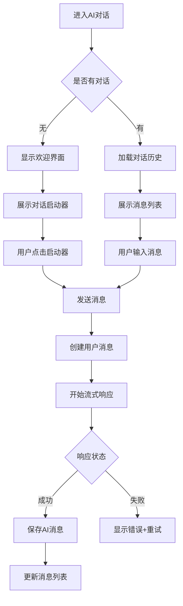
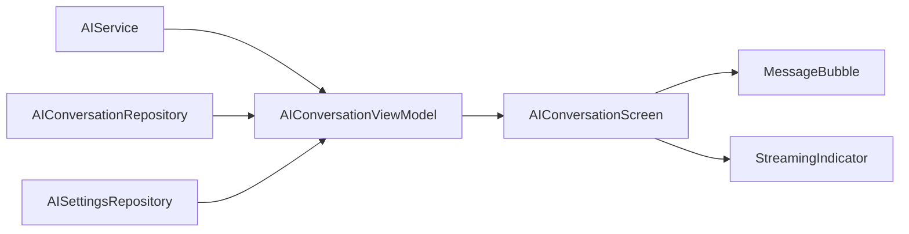

# AI 对话模块 (AIConversation)

> 返回 [文档中心](../INDEX.md)

## 功能概述

AI 对话模块提供智能对话功能，让用户可以与 AI 助手进行自然语言交流。支持流式响应、思考过程展示、对话历史管理等特性，为用户提供流畅的 AI 交互体验。

### 核心价值
- 流式响应，实时展示 AI 回复
- 支持思考模式，展示 AI 推理过程
- 对话历史持久化，支持多会话管理
- 富文本渲染，支持 Markdown、代码高亮

## 用户场景

### 场景 1: 日常对话
用户在时间轴主页切换到 AI 模式，与 AI 助手进行日常交流，获取建议或帮助。

### 场景 2: 深度思考
用户开启思考模式，AI 会展示推理过程，帮助用户理解回答的逻辑。

### 场景 3: 历史回顾
用户通过历史侧边栏查看过往对话，继续之前的话题。

## 交互流程



## 模块结构

### 文件组织

```
Features/AIConversation/
├── AIConversationScreen.swift      # 主视图
├── AIConversationViewModel.swift   # 视图模型
└── Views/
    ├── MessageBubble.swift         # 消息气泡组件
    ├── MessageBubbleTests.swift    # 消息气泡测试
    ├── StreamingIndicator.swift    # 流式响应指示器
    └── ThinkingSection.swift       # 思考过程展示
```

### 核心组件

| 组件 | 职责 |
|------|------|
| `AIConversationScreen` | 主视图，管理消息列表和空状态 |
| `AIConversationViewModel` | 业务逻辑，消息发送和流式处理 |
| `MessageBubble` | 消息气泡渲染，支持用户/AI消息 |
| `StreamingIndicator` | 流式响应动画指示器 |
| `ThinkingSection` | 思考过程折叠展示 |
| `WelcomeView` | 空状态欢迎界面 |

## 技术实现

### AIConversationScreen

主视图负责：
- 根据消息状态显示欢迎界面或消息列表
- 处理流式响应的实时更新
- 自动滚动到最新消息
- 响应输入提交通知

```swift
// 文件路径: Features/AIConversation/AIConversationScreen.swift
public struct AIConversationScreen: View {
    @StateObject private var vm = AIConversationViewModel()
    @EnvironmentObject private var appState: AppState
    
    public var body: some View {
        VStack(spacing: 0) {
            if vm.messages.isEmpty && !vm.isStreaming {
                WelcomeView(onStarterTap: { starter in
                    vm.sendMessage(starter)
                })
            } else {
                messagesScrollView
            }
        }
    }
}
```

### AIConversationViewModel

视图模型负责：
- 管理对话和消息状态
- 协调 AIService 和 AIConversationRepository
- 处理流式响应回调
- 管理思考模式设置

```swift
// 文件路径: Features/AIConversation/AIConversationViewModel.swift
public final class AIConversationViewModel: ObservableObject {
    @Published public var conversation: AIConversation?
    @Published public var messages: [AIMessage] = []
    @Published public var isStreaming: Bool = false
    @Published public var streamingContent: String = ""
    @Published public var streamingReasoning: String = ""
    @Published public var thinkingModeEnabled: Bool = false
    
    // 核心方法
    public func loadConversation(id: String)
    public func createNewConversation()
    public func sendMessage(_ content: String)
    public func retryLastMessage()
    public func cancelStreaming()
    public func toggleThinkingMode()
}
```

### 数据流



## 关键功能

### 1. 流式响应

AI 响应采用流式传输，实时更新界面：

```swift
aiService.sendMessage(
    messages: messageHistory,
    enableThinking: thinkingModeEnabled,
    onContentUpdate: { content in
        self.streamingContent = content
    },
    onReasoningUpdate: { reasoning in
        self.streamingReasoning = reasoning
    },
    onComplete: { result in
        self.handleStreamingComplete(result)
    }
)
```

### 2. 思考模式

开启思考模式后，AI 会返回推理过程：
- 推理内容通过 `ThinkingSection` 折叠展示
- 用户可展开查看完整推理过程
- 设置持久化到 UserDefaults

### 3. 消息渲染

`MessageBubble` 支持富文本渲染：
- Markdown 格式解析
- 代码块语法高亮
- 用户/AI 消息样式区分
- 思考内容折叠展示

### 4. 对话管理

- 自动创建新对话
- 首条消息自动生成标题
- 对话历史持久化
- 支持删除对话

## 依赖关系

### Repository 依赖
- `AIConversationRepository`: 对话和消息持久化
- `AISettingsRepository`: AI 设置管理

### Service 依赖
- `AIService`: AI API 调用和流式处理

### 通知监听
- `gj_submit_input`: 用户提交输入（仅在 AI 模式下处理）

## 相关文档

- [AI 模型文档](../data/ai-models.md)
- [MVVM 模式](../architecture/mvvm-pattern.md)
- [RichTextRenderer 组件](../components/molecules.md)

---
**版本**: v1.0.0  
**作者**: Kiro AI Assistant  
**更新日期**: 2024-12-17  
**状态**: 已发布
