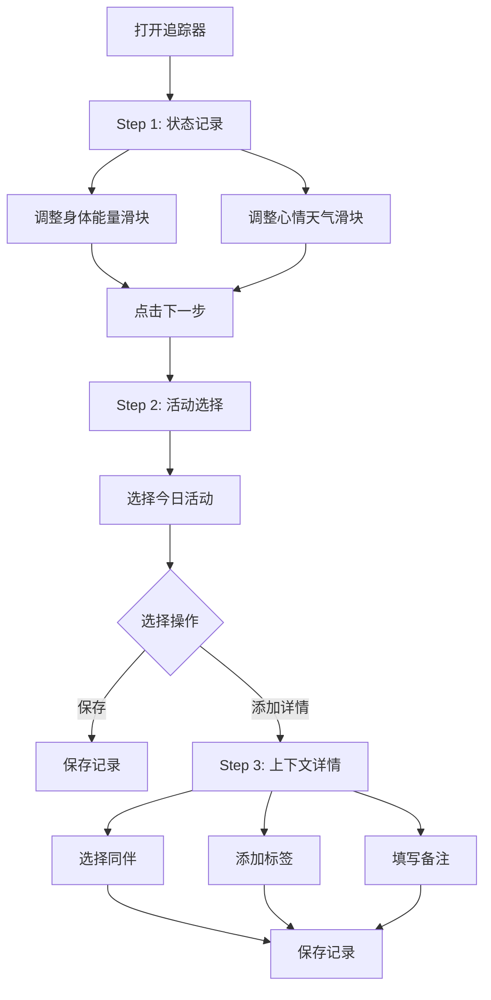
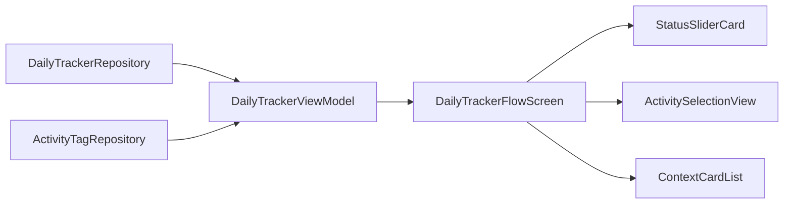

# 每日追踪模块 (DailyTracker)

> 返回 [文档中心](../INDEX.md)

## 功能概述

每日追踪模块提供三步式的日常状态记录流程，帮助用户快速记录身体能量、心情天气和活动情况。通过简洁的交互设计，让用户在几秒钟内完成每日状态的记录。

### 核心价值
- 三步快速记录：状态 → 活动 → 详情
- 连续滑块设计，精确捕捉状态变化
- 活动上下文记录，支持同伴和标签
- 数据持久化，支持历史回顾

## 用户场景

### 场景 1: 快速记录
用户在时间轴主页点击追踪入口，通过三步流程快速记录当日状态。

### 场景 2: 详细记录
用户选择活动后，进入第三步添加详细上下文（同伴、标签、备注）。

### 场景 3: 编辑记录
用户点击已有的追踪卡片，进入编辑模式修改之前的记录。

## 交互流程



## 模块结构

### 文件组织

```
Features/DailyTracker/
├── DailyTrackerFlowScreen.swift    # 主视图（三步流程）
└── DailyTrackerViewModel.swift     # 视图模型
```

### 核心组件

| 组件 | 职责 |
|------|------|
| `DailyTrackerFlowScreen` | 三步流程主视图 |
| `DailyTrackerViewModel` | 状态管理和业务逻辑 |
| `StatusSliderCard` | 状态滑块卡片 |
| `SelectableChip` | 可选择标签组件 |
| `ContextCard` | 活动上下文卡片 |
| `ContextDetailSheet` | 上下文详情编辑面板 |

## 技术实现

### DailyTrackerFlowScreen

主视图负责：
- 管理三步流程导航
- 根据步骤渲染不同内容
- 处理保存和取消操作
- 支持新建和编辑模式

```swift
// 文件路径: Features/DailyTracker/DailyTrackerFlowScreen.swift
public struct DailyTrackerFlowScreen: View {
    @StateObject private var vm: DailyTrackerViewModel
    
    // 新建模式
    public init(onClose: @escaping () -> Void) {
        self._vm = StateObject(wrappedValue: DailyTrackerViewModel())
        self.onClose = onClose
    }
    
    // 编辑模式
    public init(record: DailyTrackerRecord, onClose: @escaping () -> Void) {
        self._vm = StateObject(wrappedValue: DailyTrackerViewModel(record: record))
        self.onClose = onClose
    }
}
```

### DailyTrackerViewModel

视图模型负责：
- 管理三步流程状态
- 处理活动选择和上下文
- 数据验证和保存
- 标签创建和管理

```swift
// 文件路径: Features/DailyTracker/DailyTrackerViewModel.swift
public final class DailyTrackerViewModel: ObservableObject {
    @Published public var step: Int = 1
    @Published public var bodyEnergy: Int = 50      // 0-100
    @Published public var moodWeather: Int = 50     // 0-100
    @Published public var selectedActivities: Set<ActivityType> = []
    @Published public var activityContexts: [ActivityType: ActivityContext] = [:]
    
    // 核心方法
    public func goToStep(_ step: Int)
    public func toggleActivity(_ type: ActivityType)
    public func toggleCompanion(_ companion: CompanionType, for activity: ActivityType)
    public func createTag(text: String, for activity: ActivityType)
    public func save()
}
```

### 数据流



## 关键功能

### 1. 三步流程

| 步骤 | 内容 | 可选操作 |
|------|------|----------|
| Step 1 | 身体能量 + 心情天气 | 下一步 |
| Step 2 | 活动选择 | 保存 / 添加详情 |
| Step 3 | 上下文详情 | 保存 |

### 2. 状态滑块

使用 0-100 连续滑块，映射到离散等级：

```swift
// 身体能量等级
public enum BodyEnergyLevel {
    case exhausted    // 0-14
    case tired        // 15-29
    case low          // 30-44
    case normal       // 45-54
    case good         // 55-69
    case energetic    // 70-84
    case excellent    // 85-100
}

// 心情天气等级 (MindValence)
public enum MindValence {
    case veryUnpleasant    // 0-14
    case unpleasant        // 15-29
    case slightlyUnpleasant // 30-44
    case neutral           // 45-54
    case slightlyPleasant  // 55-69
    case pleasant          // 70-84
    case veryPleasant      // 85-100
}
```

### 3. 活动类型

支持多种活动类型，每种有默认同伴设置：

```swift
public enum ActivityType: String, CaseIterable {
    case work, study, exercise, social
    case entertainment, rest, travel, meal
    case shopping, housework, health, creative
}
```

### 4. 上下文记录

每个活动可记录：
- 同伴类型（独自、家人、朋友、同事等）
- 自定义标签
- 详细备注

## 依赖关系

### Repository 依赖
- `DailyTrackerRepository`: 追踪记录持久化
- `ActivityTagRepository`: 活动标签管理

### 通知发送
- `gj_tracker_updated`: 追踪记录更新后发送

## 相关文档

- [追踪器模型](../data/tracker-models.md)
- [StatusSliderCard 组件](../components/molecules.md)
- [SelectableChip 组件](../components/atoms.md)

---
**版本**: v1.0.0  
**作者**: Kiro AI Assistant  
**更新日期**: 2024-12-17  
**状态**: 已发布
