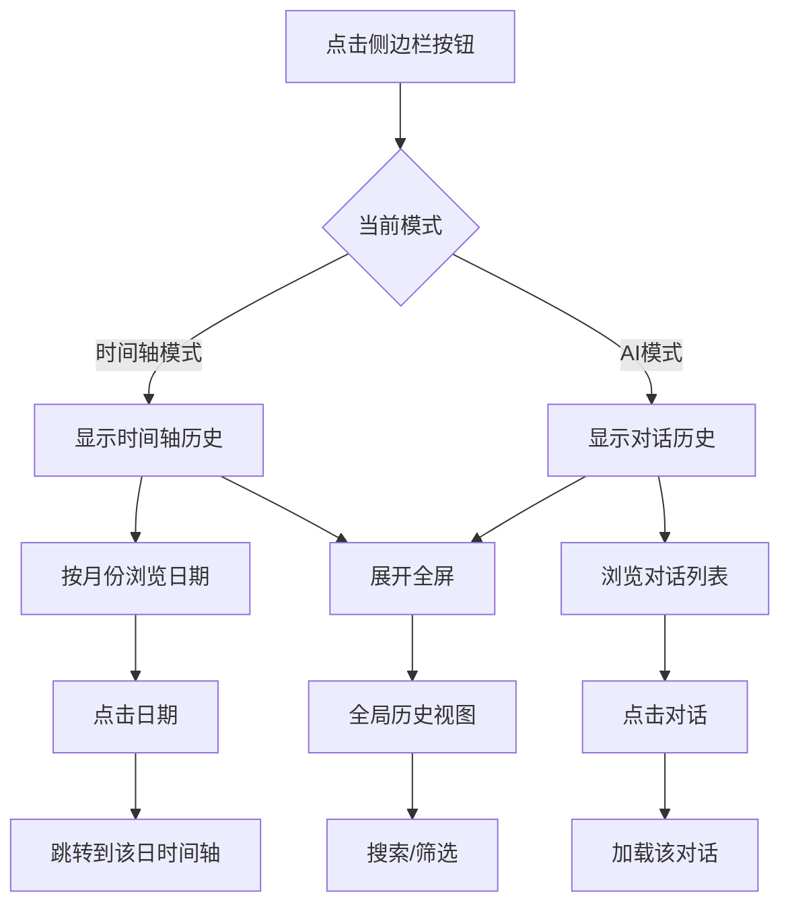
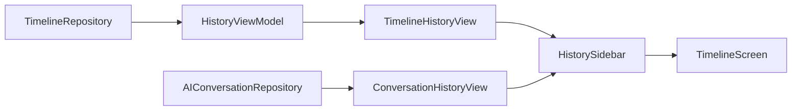

# 历史记录模块 (History)

> 返回 [文档中心](../INDEX.md)

## 功能概述

历史记录模块提供时间轴和 AI 对话的历史浏览功能。通过侧边栏设计，用户可以快速浏览过往记录，支持按月份筛选和全局搜索。

### 核心价值
- 统一的历史浏览入口
- 根据当前模式自动切换内容（时间轴/AI对话）
- 支持侧边栏和全屏两种浏览模式
- 按月份组织，支持快速跳转

## 用户场景

### 场景 1: 浏览时间轴历史
用户在时间轴模式下打开侧边栏，按月份浏览过往的日记记录。

### 场景 2: 浏览对话历史
用户在 AI 模式下打开侧边栏，查看和继续之前的对话。

### 场景 3: 全局搜索
用户展开侧边栏进入全屏模式，进行跨时间范围的搜索。

## 交互流程



## 模块结构

### 文件组织

```
Features/History/
├── HistorySidebar.swift           # 侧边栏容器
├── HistoryViewModel.swift         # 视图模型
├── Models/
│   └── HistoryContext.swift       # 上下文枚举
└── Views/
    ├── ConversationHistoryView.swift  # AI对话历史
    ├── GlobalHistoryView.swift        # 全局历史视图
    ├── TimelineHistoryView.swift      # 时间轴历史
    └── YearMonthPickerSheet.swift     # 年月选择器
```

### 核心组件

| 组件 | 职责 |
|------|------|
| `HistorySidebar` | 侧边栏容器，管理模式切换和展开状态 |
| `HistoryViewModel` | 时间轴历史数据管理 |
| `TimelineHistoryView` | 时间轴历史列表 |
| `ConversationHistoryView` | AI 对话历史列表 |
| `GlobalHistoryView` | 全屏全局历史视图 |
| `YearMonthPickerSheet` | 年月快速选择器 |

## 技术实现

### HistorySidebar

侧边栏容器负责：
- 根据 `appState.currentMode` 切换内容
- 管理侧边栏/全屏状态切换
- 处理关闭回调

```swift
// 文件路径: Features/History/HistorySidebar.swift
public struct HistorySidebar: View {
    @EnvironmentObject private var appState: AppState
    var context: HistoryContext
    @Binding var isExpanded: Bool
    var onRequestClose: (() -> Void)?
    
    public var body: some View {
        ZStack {
            if isExpanded {
                GlobalHistoryView(onClose: { ... })
            } else {
                if appState.currentMode == .ai {
                    ConversationHistoryView(...)
                } else {
                    TimelineHistoryView(...)
                }
            }
        }
    }
}
```

### HistoryViewModel

视图模型负责：
- 获取所有时间轴数据
- 按月份筛选和排序
- 计算数据范围

```swift
// 文件路径: Features/History/HistoryViewModel.swift
public final class HistoryViewModel: ObservableObject {
    @Published public var searchText: String = ""
    @Published public private(set) var timelines: [DailyTimeline] = []
    @Published public private(set) var currentDisplayDate: Date = Date()
    
    public var minDate: Date?
    public var maxDate: Date?
    
    // 核心方法
    public func fetchTimelines()
    public func jumpToMonth(date: Date)
    public var hasEarlierData: Bool
}
```

### 数据流



## 关键功能

### 1. 模式感知

侧边栏根据 `AppState.currentMode` 自动切换内容：
- 时间轴模式：显示 `TimelineHistoryView`
- AI 模式：显示 `ConversationHistoryView`

### 2. 月份排序逻辑

```swift
// 当前月份：降序（新 → 旧）
// 历史月份：升序（旧 → 新）
if isCurrentMonth {
    self.timelines = filtered.sorted(by: { $0.date > $1.date })
} else {
    self.timelines = filtered.sorted(by: { $0.date < $1.date })
}
```

### 3. 智能标题显示

时间轴历史列表的标题显示逻辑：
- 如果 `DailyTimeline.title` 存在：显示标题（粗体）
- 如果标题为 `null`：显示当天第一段文字内容（常规字体，单行省略）
- 提取逻辑：遍历 `items` → `entries`，找到第一个非空 `content`

```swift
// 提取第一段文字内容
private func firstTextContent(from timeline: DailyTimeline) -> String {
    for item in timeline.items {
        let entries: [JournalEntry]
        switch item {
        case .scene(let scene): entries = scene.entries
        case .journey(let journey): entries = journey.entries
        }
        for entry in entries {
            if let content = entry.content, !content.isEmpty {
                return content
            }
        }
    }
    return Localization.tr("noContent")
}
```

### 4. 智能标签显示

标签显示逻辑：
- 如果 `timeline.tags` 不为空：显示标签图标（最多5个，超出显示 "+N"）
- 如果 `timeline.tags` 为空：不显示标签区域（避免显示 "无标签" 占位符）

### 5. 展开动画

侧边栏支持拖拽展开到全屏：
- 使用 `spring` 动画
- 支持手势拖拽触发

### 6. 上下文枚举

```swift
public enum HistoryContext {
    case timeline    // 从时间轴打开
    case ai          // 从AI对话打开
}
```

## 依赖关系

### Repository 依赖
- `TimelineRepository`: 时间轴数据获取
- `AIConversationRepository`: AI 对话数据获取

### AppState 依赖
- `currentMode`: 当前应用模式
- `selectedDate`: 选中的日期
- `currentConversationId`: 当前对话 ID

## 相关文档

- [时间轴模块](./timeline.md)
- [AI 对话模块](./ai-conversation.md)
- [时间轴模型](../data/timeline-models.md)

---
**版本**: v1.1.0  
**作者**: Kiro AI Assistant  
**更新日期**: 2024-12-19  
**状态**: 已发布
