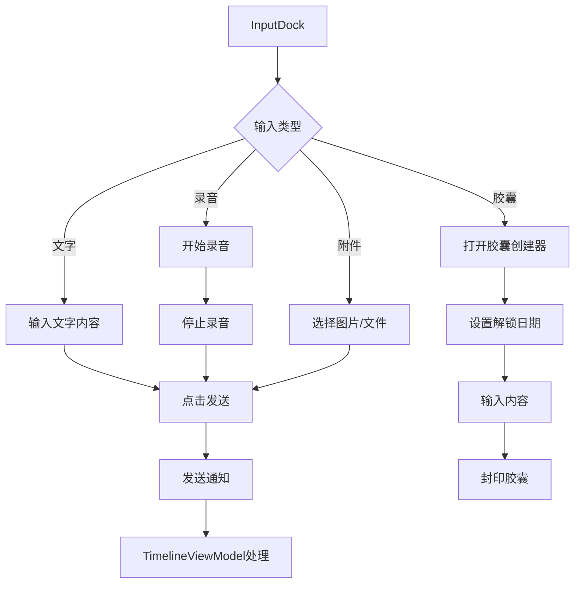
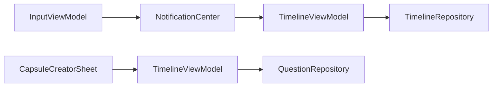

# 输入模块 (Input)

> 返回 [文档中心](../INDEX.md)

## 功能概述

输入模块提供统一的内容输入功能，支持文字、图片、音频、文件等多种媒体类型的输入。通过底部输入栏（InputDock）和时间胶囊创建器，为用户提供便捷的记录入口。

### 核心价值
- 统一的多媒体输入入口
- 支持录音和语音输入
- 时间胶囊创建功能
- 附件管理和预览

## 用户场景

### 场景 1: 快速文字记录
用户在输入栏输入文字，点击发送按钮提交到时间轴。

### 场景 2: 多媒体记录
用户通过输入栏添加图片、文件或录音，与文字一起提交。

### 场景 3: 创建时间胶囊
用户点击时间胶囊按钮，设置解锁日期和内容，创建封印记忆。

## 交互流程



## 模块结构

### 文件组织

```
Features/Input/
├── CapsuleCreatorSheet.swift    # 时间胶囊创建器
└── InputViewModel.swift         # 输入视图模型
```

### 核心组件

| 组件 | 职责 |
|------|------|
| `InputViewModel` | 输入状态管理、录音控制、附件管理 |
| `CapsuleCreatorSheet` | 时间胶囊创建界面 |
| `InputDock` | 底部输入栏（位于 UI/Organisms） |
| `InputMenuPanel` | 输入菜单面板（位于 UI/Organisms） |

## 技术实现

### InputViewModel

视图模型负责：
- 管理输入文本和附件状态
- 控制录音功能
- 处理文件导入
- 发送提交通知

```swift
// 文件路径: Features/Input/InputViewModel.swift
public final class InputViewModel: NSObject, ObservableObject, AVAudioRecorderDelegate {
    @Published public var isMenuOpen: Bool = false
    @Published public var isRecording: Bool = false
    @Published public var recordingSeconds: Int = 0
    @Published public var text: String = ""
    @Published public var attachments: [AttachmentItem] = []
    @Published public var replyQuestionId: String? = nil
    
    public var pendingImages: [UIImage] = []
    
    // 核心方法
    public func startRecording()
    public func stopRecording()
    public func submit()
    public func addPhoto(name: String, image: UIImage?)
    public func addFile(name: String, url: URL)
    public func importFile(url: URL, isAudio: Bool)
    public func removeAttachment(id: String)
}
```

### CapsuleCreatorSheet

时间胶囊创建器负责：
- 设置解锁日期（支持快捷选项）
- 输入胶囊内容
- 可选添加系统问题
- 封印并保存胶囊

```swift
// 文件路径: Features/Input/CapsuleCreatorSheet.swift
public struct CapsuleCreatorSheet: View {
    @Binding var prompt: String
    @Binding var deliveryDate: Date
    @Binding var sealed: Bool
    @Binding var showSystemQuestion: Bool
    @Binding var systemQuestion: String
    
    public var onSave: ((String, String, Date, Bool, String?) -> Void)?
    public var onClose: (() -> Void)?
}
```

### 数据流



## 关键功能

### 1. 录音功能

使用 AVAudioRecorder 实现录音：

```swift
// 录音设置
let settings: [String: Any] = [
    AVFormatIDKey: Int(kAudioFormatMPEG4AAC),
    AVSampleRateKey: 44100,
    AVNumberOfChannelsKey: 1,
    AVEncoderAudioQualityKey: AVAudioQuality.high.rawValue
]
```

- 录音自动保存为 M4A 格式
- 停止录音后自动提交
- 支持取消录音

### 2. 附件管理

```swift
public struct AttachmentItem: Identifiable, Hashable {
    public let id: String
    public let type: String      // "photo" | "file"
    public let name: String
    public let url: URL?
}
```

- 支持图片和文件附件
- 文件自动复制到 Documents 目录
- 支持删除附件

### 3. 时间胶囊快捷日期

| 选项 | 天数 |
|------|------|
| 明天 | 1 |
| 下周 | 7 |
| 一个月 | 30 |
| 三个月 | 90 |
| 一年 | 365 |

### 4. 提交通知

通过 NotificationCenter 发送提交通知：

```swift
NotificationCenter.default.post(
    name: Notification.Name("gj_submit_input"),
    object: nil,
    userInfo: [
        "text": text,
        "images": pendingImages,
        "audio": currentAudioPath,
        "duration": durationString,
        "files": files,
        "replyQuestionId": replyQuestionId
    ]
)
```

## 依赖关系

### 系统框架
- `AVFoundation`: 录音功能
- `Speech`: 语音识别（预留）

### 通知发送
- `gj_submit_input`: 提交输入内容

### AppState 依赖
- `showCapsuleCreator`: 控制胶囊创建器显示
- `capsuleDraft*`: 胶囊草稿状态

## 相关文档

- [时间轴模块](./timeline.md)
- [InputDock 组件](../components/organisms.md)
- [时间轴模型](../data/timeline-models.md)

---
**版本**: v1.0.0  
**作者**: Kiro AI Assistant  
**更新日期**: 2024-12-17  
**状态**: 已发布
