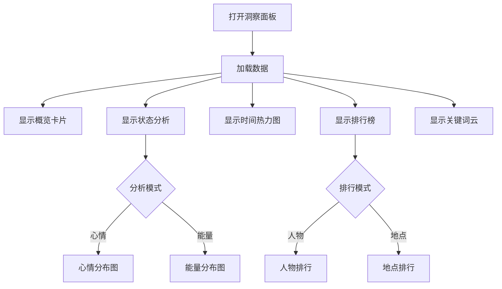
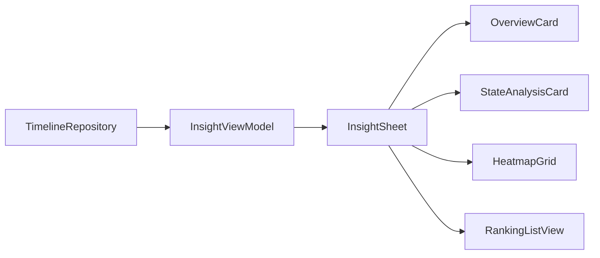

# 数据洞察模块 (Insight)

> 返回 [文档中心](../INDEX.md)

## 功能概述

数据洞察模块提供用户记录数据的可视化分析，包括连续记录天数、总条目统计、时间分布热力图、心情/能量分析、人物/地点排行等多维度洞察。

### 核心价值
- 多维度数据可视化
- 记录习惯分析（连续天数、时间分布）
- 心情和能量状态追踪
- 人物和地点关联分析

## 用户场景

### 场景 1: 查看记录统计
用户打开洞察面板，查看连续记录天数、总记录天数和总条目数。

### 场景 2: 分析记录习惯
用户通过时间热力图了解自己的记录时间分布规律。

### 场景 3: 情绪回顾
用户通过心情/能量分析图表了解近期的情绪状态变化。

## 交互流程



## 模块结构

### 文件组织

```
Features/Insight/
├── InsightSheet.swift       # 洞察面板主视图
└── InsightViewModel.swift   # 视图模型
```

### 核心组件

| 组件 | 职责 |
|------|------|
| `InsightSheet` | 洞察面板主视图 |
| `InsightViewModel` | 数据计算和状态管理 |
| `OverviewCard` | 概览统计卡片 |
| `StateAnalysisCard` | 状态分析卡片 |
| `HeatmapGrid` | 时间热力图 |
| `RankingListView` | 排行榜视图 |
| `KeywordsCloudView` | 关键词云 |

## 技术实现

### InsightSheet

主视图负责：
- 组织各个分析组件的布局
- 提供时间范围选择器
- 展示综合洞察数据

```swift
// 文件路径: Features/Insight/InsightSheet.swift
public struct InsightSheet: View {
    @StateObject private var vm = InsightViewModel()
    
    public var body: some View {
        VStack(spacing: 16) {
            // 时间范围选择器
            Picker("", selection: ...) {
                Text("week").tag("Week")
                Text("month").tag("Month")
                Text("year").tag("Year")
                Text("all").tag("All")
            }
            
            OverviewCard(streak: vm.streak, ...)
            StateAnalysisCard(vm: vm)
            HeatmapGrid(hourCounts: vm.hourCounts)
            RankingListView(vm: vm)
            KeywordsCloudView(words: vm.topCategories)
        }
    }
}
```

### InsightViewModel

视图模型负责：
- 计算连续记录天数
- 统计条目分布
- 生成图表数据
- 构建排行榜

```swift
// 文件路径: Features/Insight/InsightViewModel.swift
public final class InsightViewModel: ObservableObject {
    @Published public private(set) var streak: Int = 0
    @Published public private(set) var totalDays: Int = 0
    @Published public private(set) var totalEntries: Int = 0
    @Published public private(set) var hourCounts: [Int] = Array(repeating: 0, count: 24)
    @Published public private(set) var chartItemsMood: [RingChartItem] = []
    @Published public private(set) var chartItemsEnergy: [RingChartItem] = []
    @Published public private(set) var peopleRanking: [(name: String, count: Int, percent: Int)] = []
    @Published public private(set) var locationRanking: [(name: String, count: Int, percent: Int)] = []
    @Published public private(set) var topCategories: [String] = []
    
    @Published public var analysisMode: String = "mood"
    @Published public var rankingMode: String = "people"
    
    public func compute()
}
```

### 数据流



## 关键功能

### 1. 概览统计

| 指标 | 说明 |
|------|------|
| streak | 连续记录天数 |
| totalDays | 总记录天数 |
| totalEntries | 总条目数 |

### 2. 时间热力图

24 小时分布统计：
```swift
@Published public private(set) var hourCounts: [Int] = Array(repeating: 0, count: 24)
```

### 3. 状态分析

心情分析（按类别映射）：
- 梦境 (dream) → 蓝色
- 情绪 (emotion) → 橙色
- 健康 (health) → 绿色
- 工作 (work) → 灰色

能量分析（按活动类型）：
- 高能量：工作 + 社交
- 低能量：梦境 + 媒体
- 心流：健康 + 情绪

### 4. 排行榜

人物排行：
- 扫描条目内容中的关键词
- 统计出现频率
- 按频率排序

地点排行：
- 统计场景块的地点
- 统计旅程块的起点/终点
- 按频率排序

### 5. 关键词云

提取 Top 5 类别标签作为关键词展示。

## 依赖关系

### Repository 依赖
- `TimelineRepository`: 获取时间轴数据

### 数据模型依赖
- `DailyTimeline`: 每日时间轴
- `JournalEntry`: 日记条目
- `EntryCategory`: 条目类别

## 相关文档

- [时间轴模块](./timeline.md)
- [时间轴模型](../data/timeline-models.md)
- [ChartAtoms 组件](../components/atoms.md)

---
**版本**: v1.0.0  
**作者**: Kiro AI Assistant  
**更新日期**: 2024-12-17  
**状态**: 已发布
