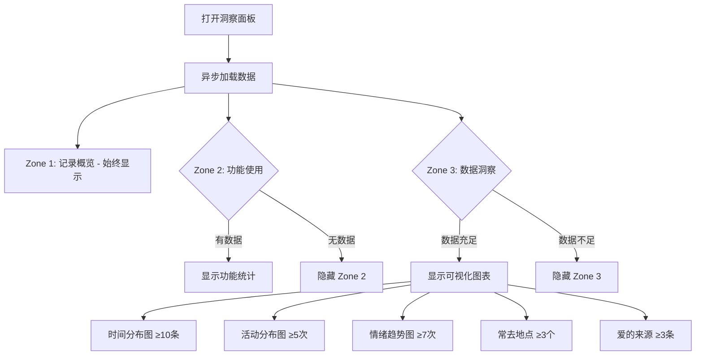
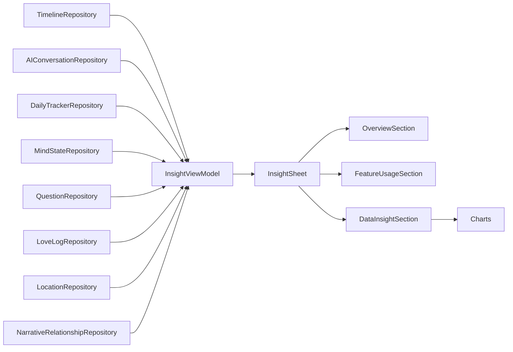

# 数据洞察模块 (Insight)

> 返回 [文档中心](../INDEX.md)

## 功能概述

数据洞察模块提供用户记录数据的可视化分析，采用**三区布局**设计：记录概览（始终显示）、功能使用（有数据显示）、数据洞察（足够数据显示）。基于真实 L1 数据层动态计算统计结果。

### 核心价值
- 三区布局：简洁美观，有数据显示，无数据隐藏
- 动态计算：基于真实数据，内存缓存，快速响应
- 条件显示：根据数据量智能显示图表
- 多维度洞察：记录习惯、功能使用、数据分布

## 用户场景

### 场景 1: 查看记录概览
用户打开洞察面板，查看连续记录天数、总记录天数、总条目数和总字数。

### 场景 2: 了解功能使用情况
用户查看各功能模块的使用统计（AI对话、每日追踪、心境记录、时间胶囊、爱的表达、关系数量）。

### 场景 3: 分析数据洞察
当数据量足够时，用户通过可视化图表了解记录时间分布、活动分布、情绪趋势、常去地点和爱的来源。

## 交互流程



## 模块结构

### 文件组织

```
Features/Insight/
├── InsightSheet.swift              # 洞察面板主视图
├── InsightViewModel.swift          # 视图模型
└── Views/
    ├── OverviewSection.swift       # Zone 1: 记录概览
    ├── FeatureUsageSection.swift   # Zone 2: 功能使用
    ├── DataInsightSection.swift    # Zone 3: 数据洞察
    └── Charts/
        ├── HourDistributionChart.swift  # 24小时分布图
        ├── ActivityPieChart.swift       # 活动饼图
        └── MoodTrendChart.swift         # 情绪趋势图

Core/Models/
└── InsightModels.swift             # 统计数据模型

DataLayer/Repositories/
└── LoveLogRepository.swift         # 爱的表达数据仓库
```

### 核心组件

| 组件 | 职责 |
|------|------|
| `InsightSheet` | 洞察面板主视图，三区布局 |
| `InsightViewModel` | 数据计算、状态管理、条件显示逻辑 |
| `OverviewSection` | Zone 1: 记录概览（连续天数、总天数、总条目、总字数） |
| `FeatureUsageSection` | Zone 2: 功能使用统计（AI、追踪、心境、胶囊、爱、关系） |
| `DataInsightSection` | Zone 3: 数据洞察容器 |
| `HourDistributionChart` | 24小时记录时间分布柱状图 |
| `ActivityPieChart` | 活动类型分布饼图 |
| `MoodTrendChart` | 情绪趋势折线图 |

## 技术实现

### InsightSheet

主视图负责：
- 三区布局组织
- 条件显示各区域
- 加载状态指示
- 底部"洞察引擎"标识

```swift
// 文件路径: Features/Insight/InsightSheet.swift
public struct InsightSheet: View {
    @StateObject private var vm = InsightViewModel()
    
    public var body: some View {
        ScrollView {
            VStack(spacing: 24) {
                // Zone 1: 始终显示
                OverviewSection(stats: vm.overview)
                
                // Zone 2: 有数据显示
                if vm.showZone2 {
                    FeatureUsageSection(stats: vm.featureUsage)
                }
                
                // Zone 3: 足够数据显示
                if vm.showZone3 {
                    DataInsightSection(
                        stats: vm.dataInsight,
                        showHourChart: vm.showHourChart,
                        showActivityChart: vm.showActivityChart,
                        showMoodChart: vm.showMoodChart,
                        showLocationRank: vm.showLocationRank,
                        showLoveRank: vm.showLoveRank
                    )
                }
                
                // 洞察引擎标识
                Text("洞察引擎")
                    .font(.caption)
                    .foregroundColor(.secondary)
            }
        }
        .overlay {
            if vm.isLoading {
                ProgressView()
            }
        }
    }
}
```

### InsightViewModel

视图模型负责：
- 从各 Repository 读取数据
- 计算三区统计数据
- 管理条件显示逻辑
- 异步计算和内存缓存
- 监听数据更新通知

```swift
// 文件路径: Features/Insight/InsightViewModel.swift
public final class InsightViewModel: ObservableObject {
    // Zone 1: 记录概览 - 始终显示
    @Published public private(set) var overview = OverviewStats(
        streak: 0, totalDays: 0, totalEntries: 0, totalWords: 0
    )
    
    // Zone 2: 功能使用 - 有数据显示
    @Published public private(set) var featureUsage = FeatureUsageStats(
        aiConversations: 0, aiMessages: 0, trackerDays: 0,
        mindRecords: 0, capsuleTotal: 0, capsulePending: 0,
        loveLogCount: 0, relationshipCount: 0
    )
    @Published public private(set) var showZone2: Bool = false
    
    // Zone 3: 数据洞察 - 足够数据显示
    @Published public private(set) var dataInsight = DataInsightStats(
        hourDistribution: [], activityDistribution: [:],
        moodTrend: [], topLocations: [], loveSources: []
    )
    @Published public private(set) var showHourChart: Bool = false
    @Published public private(set) var showActivityChart: Bool = false
    @Published public private(set) var showMoodChart: Bool = false
    @Published public private(set) var showLocationRank: Bool = false
    @Published public private(set) var showLoveRank: Bool = false
    @Published public private(set) var showZone3: Bool = false
    
    // 加载状态
    @Published public private(set) var isLoading: Bool = false
    
    @MainActor
    public func compute() async {
        // 异步计算统计数据
        // 更新条件显示标志
    }
}
```

### 数据流



## 关键功能

### Zone 1: 记录概览（始终显示）

| 指标 | 数据来源 | 计算逻辑 |
|------|----------|----------|
| streak | DailyTimeline | 从今天向前遍历，有 JournalEntry 则计入 |
| totalDays | DailyTimeline | 统计所有包含 JournalEntry 的天数 |
| totalEntries | JournalEntry | 统计所有 Scene/Journey 中的 JournalEntry 总数 |
| totalWords | JournalEntry.content | 累加所有 content 的字符数 |

```swift
struct OverviewStats {
    let streak: Int           // 连续天数
    let totalDays: Int        // 总天数
    let totalEntries: Int     // 总条目
    let totalWords: Int       // 总字数
}
```

### Zone 2: 功能使用（有数据显示）

| 统计项 | 数据来源 | 显示条件 | 展示形式 |
|--------|----------|----------|----------|
| AI 对话 | AIConversation | count > 0 | X次对话 / Y条消息 |
| 每日追踪 | DailyTrackerRecord | count > 0 | X天追踪 |
| 心境记录 | MindStateRecord | count > 0 | X次记录 |
| 时间胶囊 | QuestionEntry | count > 0 | X个胶囊 / Y个待开启 |
| 爱的表达 | LoveLog | count > 0 | X条记录 |
| 关系数量 | NarrativeRelationship | count > 0 | X个关系 |

```swift
struct FeatureUsageStats {
    let aiConversations: Int      // AI 对话次数
    let aiMessages: Int           // AI 消息数
    let trackerDays: Int          // 追踪天数
    let mindRecords: Int          // 心境记录次数
    let capsuleTotal: Int         // 时间胶囊总数
    let capsulePending: Int       // 待开启胶囊
    let loveLogCount: Int         // 爱的表达次数
    let relationshipCount: Int    // 关系数量
    
    var hasAnyData: Bool {
        aiConversations > 0 || trackerDays > 0 || mindRecords > 0 ||
        capsuleTotal > 0 || loveLogCount > 0 || relationshipCount > 0
    }
}
```

### Zone 3: 数据洞察（足够数据显示）

| 统计项 | 数据来源 | 显示条件 | 展示形式 |
|--------|----------|----------|----------|
| 记录时间分布 | JournalEntry.timestamp | ≥10条记录 | 24小时柱状图 |
| 活动分布 | DailyTrackerRecord.activities | ≥5次追踪 | 饼图/环形图 |
| 情绪趋势 | MindStateRecord.valenceValue | ≥7次记录 | 折线图 |
| 常去地点 | LocationVO | ≥3个地点 | 排行列表 |
| 爱的来源 | LoveLog.sender | ≥3条记录 | 排行列表 |

```swift
struct DataInsightStats {
    let hourDistribution: [Int]                    // 24小时分布 [0-23]
    let activityDistribution: [ActivityType: Int]  // 活动分布
    let moodTrend: [(date: String, value: Int)]    // 情绪趋势
    let topLocations: [(name: String, count: Int)] // 常去地点
    let loveSources: [(name: String, count: Int)]  // 爱的来源
}
```

### 可见性阈值

```swift
func updateZone3Visibility() {
    let entryCount = overview.totalEntries
    let trackerCount = featureUsage.trackerDays
    let mindCount = featureUsage.mindRecords
    let locationCount = dataInsight.topLocations.count
    let loveCount = featureUsage.loveLogCount
    
    showHourChart = entryCount >= 10
    showActivityChart = trackerCount >= 5
    showMoodChart = mindCount >= 7
    showLocationRank = locationCount >= 3
    showLoveRank = loveCount >= 3
    
    showZone3 = showHourChart || showActivityChart || showMoodChart || 
                showLocationRank || showLoveRank
}
```

## 性能优化

### 动态计算 + 内存缓存

1. **异步计算**: 所有统计计算在后台线程执行
2. **内存缓存**: 结果缓存在 ViewModel 中
3. **通知驱动**: 监听数据更新通知，自动重新计算
4. **加载指示**: 计算超过 500ms 显示加载指示器

```swift
private func setupNotifications() {
    NotificationCenter.default.publisher(for: .gj_timeline_updated)
        .sink { [weak self] _ in Task { await self?.compute() } }
        .store(in: &cancellables)
    
    NotificationCenter.default.publisher(for: .gj_mind_state_updated)
        .sink { [weak self] _ in Task { await self?.compute() } }
        .store(in: &cancellables)
    
    // ... 其他通知
}
```

## 依赖关系

### Repository 依赖
- `TimelineRepository`: 获取时间轴数据
- `AIConversationRepository`: 获取 AI 对话数据
- `DailyTrackerRepository`: 获取每日追踪数据
- `MindStateRepository`: 获取心境记录数据
- `QuestionRepository`: 获取时间胶囊数据
- `LoveLogRepository`: 获取爱的表达数据
- `LocationRepository`: 获取地点数据
- `NarrativeRelationshipRepository`: 获取关系数据

### 数据模型依赖
- `DailyTimeline`: 每日时间轴
- `JournalEntry`: 日记条目
- `AIConversation`: AI 对话
- `DailyTrackerRecord`: 每日追踪记录
- `MindStateRecord`: 心境记录
- `QuestionEntry`: 时间胶囊
- `LoveLog`: 爱的表达
- `LocationVO`: 地点视图对象
- `NarrativeRelationship`: 关系模型
- `InsightModels`: 统计数据模型（OverviewStats, FeatureUsageStats, DataInsightStats）

## 入口位置

从 ProfileScreen 进入：
- 位置：个人设置页面
- 入口：「数据统计」行项
- 图标：`chart.bar.fill`
- 展示方式：Sheet 弹窗

## 相关文档

- [时间轴模块](./timeline.md)
- [AI 对话模块](./ai-conversation.md)
- [每日追踪模块](./daily-tracker.md)
- [心境记录模块](./mind-state.md)
- [个人中心模块](./profile.md)
- [时间轴模型](../data/timeline-models.md)
- [AI 模型](../data/ai-models.md)
- [追踪模型](../data/tracker-models.md)
- [数据仓库接口](../api/repositories.md)

---
**版本**: v2.0.0  
**作者**: Kiro AI Assistant  
**更新日期**: 2024-12-19  
**状态**: 已发布
