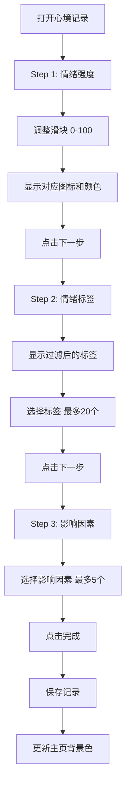
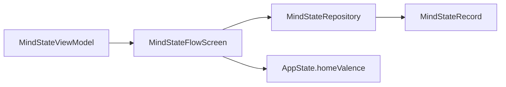

# 心境记录模块 (MindState)

> 返回 [文档中心](../INDEX.md)

## 功能概述

心境记录模块提供三步式的情绪状态记录流程，帮助用户精确捕捉和标记当前的心理状态。通过情绪强度滑块、情绪标签和影响因素三个维度，构建完整的心境画像。

### 核心价值
- 三步精确记录：强度 → 标签 → 影响因素
- 7 级情绪强度量表
- 智能标签过滤（根据情绪极性）
- 多维度影响因素分析

## 用户场景

### 场景 1: 快速情绪记录
用户通过滑块快速选择当前情绪强度，系统自动匹配对应的情绪图标和颜色。

### 场景 2: 详细情绪标注
用户选择具体的情绪标签（如"焦虑"、"兴奋"），更精确地描述当前状态。

### 场景 3: 影响因素分析
用户标记影响情绪的因素（如"工作"、"社交"），帮助后续分析情绪模式。

## 交互流程



## 模块结构

### 文件组织

```
Features/MindState/
├── MindStateFlowScreen.swift    # 三步流程主视图
└── MindStateViewModel.swift     # 视图模型
```

### 核心组件

| 组件 | 职责 |
|------|------|
| `MindStateFlowScreen` | 三步流程主视图 |
| `MindStateViewModel` | 状态管理和业务逻辑 |
| `ThickSlider` | 情绪强度滑块 |
| `TagChip` | 标签选择组件 |
| `InfluenceSection` | 影响因素分组 |

## 技术实现

### MindStateFlowScreen

主视图负责：
- 管理三步流程导航
- 根据情绪强度动态调整 UI 颜色
- 处理保存和取消操作

```swift
// 文件路径: Features/MindState/MindStateFlowScreen.swift
public struct MindStateFlowScreen: View {
    @StateObject private var vm = MindStateViewModel()
    
    public var body: some View {
        NavigationStack {
            Form {
                switch vm.step {
                case 1: // 情绪强度
                    Section { ThickSlider(...) }
                case 2: // 情绪标签
                    Section { LazyVGrid { ForEach(vm.filteredLabels) { ... } } }
                case 3: // 影响因素
                    Section { InfluenceSection(...) }
                }
            }
        }
    }
}
```

### MindStateViewModel

视图模型负责：
- 管理情绪值和步骤状态
- 根据情绪值过滤标签
- 处理标签和影响因素选择
- 生成最终记录

```swift
// 文件路径: Features/MindState/MindStateViewModel.swift
public final class MindStateViewModel: ObservableObject {
    @Published public var step: Int = 1
    @Published public var valenceValue: Double = 50  // 0-100
    @Published public var selectedLabels: Set<String> = []
    @Published public var selectedInfluences: Set<MindInfluence> = []
    
    public let maxLabels = 20
    public let maxInfluences = 5
    
    public var valenceSegment: MindValence { ... }
    public var filteredLabels: [MindLabel] { ... }
    
    public func toggleLabel(_ id: String)
    public func toggleInfluence(_ inf: MindInfluence)
    public func finalize() -> Result
}
```

### 数据流



## 关键功能

### 1. 情绪强度量表

7 级情绪强度映射：

| 值范围 | 等级 | 图标 | 颜色 |
|--------|------|------|------|
| 0-14 | veryUnpleasant | 😢 | 深红 |
| 15-34 | unpleasant | 😟 | 红色 |
| 35-49 | slightlyUnpleasant | 😕 | 浅红 |
| 50 | neutral | 😐 | 灰色 |
| 51-64 | slightlyPleasant | 🙂 | 浅绿 |
| 65-84 | pleasant | 😊 | 绿色 |
| 85-100 | veryPleasant | 😄 | 深绿 |

### 2. 智能标签过滤

根据情绪极性过滤显示的标签：

```swift
public var filteredLabels: [MindLabel] {
    let allowed: Set<MindValenceGroup> = {
        switch valenceSegment {
        case .veryUnpleasant, .unpleasant: return [.unpleasant]
        case .slightlyUnpleasant: return [.unpleasant, .neutral]
        case .neutral: return [.neutral]
        case .slightlyPleasant: return [.pleasant, .neutral]
        case .pleasant, .veryPleasant: return [.pleasant]
        }
    }()
    return MindCatalog.labels.filter { allowed.contains($0.group) }
}
```

### 3. 影响因素分类

| 分类 | 因素 |
|------|------|
| 身份认同 | identity, spirituality |
| 社交关系 | social, community, friends, family, relationships, partner, dating |
| 环境因素 | weather, home, education, work, tasks, money, health, fitness |

### 4. 主页背景联动

保存心境记录后，更新主页背景渐变色：

```swift
appState.homeValence = vm.valenceSegment
```

## 依赖关系

### Repository 依赖
- `MindStateRepository`: 心境记录持久化

### 数据模型依赖
- `MindValence`: 情绪强度枚举
- `MindLabel`: 情绪标签
- `MindInfluence`: 影响因素
- `MindStateRecord`: 心境记录

### AppState 依赖
- `homeValence`: 主页背景色状态
- `selectedDate`: 当前选中日期

## 相关文档

- [心境模型](../data/tracker-models.md)
- [ThickSlider 组件](../components/atoms.md)
- [时间轴模块](./timeline.md)

---
**版本**: v1.0.0  
**作者**: Kiro AI Assistant  
**更新日期**: 2024-12-17  
**状态**: 已发布
