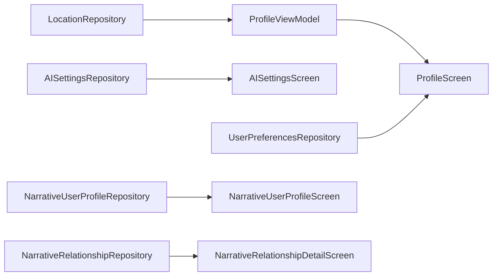

# 个人中心模块 (Profile)

> 返回 [文档中心](../INDEX.md)

## 功能概述

个人中心模块是应用的设置和管理中心，包含系统设置、AI 配置、地点管理、用户画像、关系管理等多个子功能。通过模块化设计，提供清晰的功能分类和导航。

### 核心价值
- 统一的设置管理入口
- AI 功能配置
- 地点映射管理
- 用户画像和关系管理
- 数据维护和导出

## 用户场景

### 场景 1: AI 设置
用户配置 AI API 密钥、选择默认模式（日记/AI）。

### 场景 2: 地点管理
用户管理常用地点的名称、图标和围栏范围。

### 场景 3: 数据维护
用户导出数据、清理缓存或重置应用。

## 模块结构

### 文件组织

```
Features/Profile/
├── ProfileScreen.swift                    # 主入口
├── ProfileViewModel.swift                 # 主视图模型
│
├── AI 设置
│   ├── AISettingsScreen.swift             # AI 设置页面
│   └── AISettingsViewModel.swift          # AI 设置视图模型
│
├── 地点管理
│   ├── LocationListScreen.swift           # 地点列表
│   ├── LocationDetailScreen.swift         # 地点详情
│   └── LocationMapPickerScreen.swift      # 地图选点
│
├── 用户画像
│   ├── UserProfileDetailScreen.swift      # 用户详情
│   ├── UserProfileViewModel.swift         # 用户画像视图模型
│   ├── NarrativeUserProfileScreen.swift   # 叙事用户画像
│   └── NarrativeUserProfileViewModel.swift
│
├── 关系管理
│   ├── RelationshipManagementScreen.swift # 关系列表
│   ├── RelationshipDetailScreen.swift     # 关系详情
│   ├── RelationshipEditSheet.swift        # 关系编辑
│   ├── RelationshipProfileViewModel.swift
│   ├── NarrativeRelationshipDetailScreen.swift
│   ├── NarrativeRelationshipEditSheet.swift
│   └── NarrativeRelationshipViewModel.swift
│
├── 系统设置
│   ├── NotificationsScreen.swift          # 通知设置
│   ├── DataMaintenanceScreen.swift        # 数据维护
│   ├── MembershipScreen.swift             # 会员信息
│   ├── SubscriptionInfoScreen.swift       # 订阅信息
│   └── AboutScreen.swift                  # 关于页面
│
└── 开发工具
    ├── ComponentGalleryScreen.swift       # 组件库
    └── ComponentGallerySections.swift     # 组件库分区
```

### 子页面清单 (25 个)

| 页面 | 文件 | 功能 |
|------|------|------|
| 主入口 | ProfileScreen | 设置分类导航 |
| 通知设置 | NotificationsScreen | 推送、声音、徽章设置 |
| 数据维护 | DataMaintenanceScreen | 导出、清理、重置 |
| 会员信息 | MembershipScreen | 会员等级和权益 |
| 订阅信息 | SubscriptionInfoScreen | 订阅详情 |
| 关于 | AboutScreen | 版本和法律信息 |
| AI 设置 | AISettingsScreen | API 密钥、模型选择 |
| 地点列表 | LocationListScreen | 常用地点管理 |
| 地点详情 | LocationDetailScreen | 地点编辑和围栏 |
| 地图选点 | LocationMapPickerScreen | 地图选择坐标 |
| 用户详情 | UserProfileDetailScreen | 基本信息编辑 |
| 叙事用户画像 | NarrativeUserProfileScreen | 叙事式用户画像 |
| 关系列表 | RelationshipManagementScreen | 关系人管理 |
| 关系详情 | RelationshipDetailScreen | 关系人详情 |
| 关系编辑 | RelationshipEditSheet | 关系人编辑 |
| 叙事关系详情 | NarrativeRelationshipDetailScreen | 叙事式关系详情 |
| 叙事关系编辑 | NarrativeRelationshipEditSheet | 叙事式关系编辑 |
| 组件库 | ComponentGalleryScreen | UI 组件展示 |

## 技术实现

### ProfileScreen

主入口负责：
- 组织设置分类
- 提供导航链接
- 管理 Sheet 弹出

```swift
// 文件路径: Features/Profile/ProfileScreen.swift
public struct ProfileScreen: View {
    @StateObject private var vm = ProfileViewModel()
    
    public var body: some View {
        NavigationStack {
            List {
                Section("osModules") {
                    NavigationLink(destination: NotificationsScreen(vm: vm)) { ... }
                    NavigationLink(destination: DataMaintenanceScreen(vm: vm)) { ... }
                }
                
                Section("AI.Settings.Section") {
                    Button(action: { showAISettings = true }) { ... }
                    // 默认模式选择
                    Picker("", selection: ...) { ... }
                }
                
                Section("system") {
                    // 语言、同步、关于
                }
            }
        }
    }
}
```

### ProfileViewModel

主视图模型负责：
- 管理通知偏好设置
- 管理地点映射数据
- 处理日结时间设置

```swift
// 文件路径: Features/Profile/ProfileViewModel.swift
public final class ProfileViewModel: ObservableObject {
    // 通知设置
    @Published public var pushEnabled: Bool
    @Published public var soundEnabled: Bool
    @Published public var badgeEnabled: Bool
    @Published public var dailyReminderEnabled: Bool
    @Published public var reminderTime: String
    
    // 日结时间
    @Published public var dayEndTime: String
    
    // 地点数据
    @Published public var addressMappings: [AddressMapping] = []
    @Published public var addressFences: [AddressFence] = []
    
    // 地点管理方法
    public func updateMappingName(id: String, name: String)
    public func updateMappingIcon(id: String, icon: String)
    public func deleteMapping(id: String)
    public func addFence(for mappingId: String, ...)
}
```

### 数据流



## 关键功能

### 1. AI 设置

- API 密钥配置
- 模型选择（支持多种 AI 模型）
- 默认模式设置（日记/AI）
- 思考模式开关

### 2. 地点管理

地点映射结构：
```swift
struct AddressMapping {
    let id: String
    var name: String
    var icon: String
    var color: String?
}

struct AddressFence {
    let id: String
    let mappingId: String
    var lat: Double
    var lng: Double
    var radius: Double
}
```

智能图标建议：
```swift
func suggestIconColor(for name: String) -> (icon: String, color: String) {
    // 根据名称关键词推荐图标和颜色
    if name.contains("家") { return ("home", "slate") }
    if name.contains("公司") { return ("briefcase", "indigo") }
    // ...
}
```

### 3. 通知设置

| 设置项 | 说明 |
|--------|------|
| pushEnabled | 推送通知开关 |
| soundEnabled | 声音提醒开关 |
| badgeEnabled | 角标显示开关 |
| dailyReminderEnabled | 每日提醒开关 |
| reminderTime | 提醒时间 |
| dayEndTime | 日结时间（影响"今天"的定义） |

### 4. 用户画像

支持两种画像模式：
- 传统画像：结构化字段
- 叙事画像：自由文本描述

### 5. 关系管理

支持两种关系模式：
- 传统关系：结构化关系类型
- 叙事关系：自由描述关系故事

## 依赖关系

### Repository 依赖
- `LocationRepository`: 地点映射管理
- `AISettingsRepository`: AI 设置管理
- `UserPreferencesRepository`: 用户偏好
- `NarrativeUserProfileRepository`: 叙事用户画像
- `NarrativeRelationshipRepository`: 叙事关系

### 通知发送
- `gj_addresses_changed`: 地址变更
- `gj_day_end_time_changed`: 日结时间变更

## 相关文档

- [用户画像模型](../data/user-profile-models.md)
- [AI 模型](../data/ai-models.md)
- [Repository 接口](../api/repositories.md)

---
**版本**: v1.0.0  
**作者**: Kiro AI Assistant  
**更新日期**: 2024-12-17  
**状态**: 已发布
