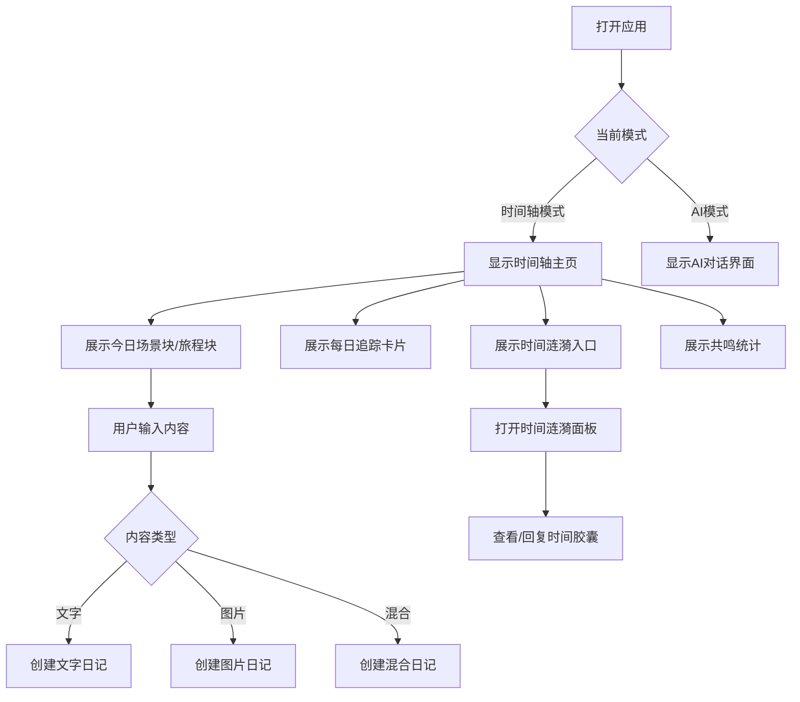
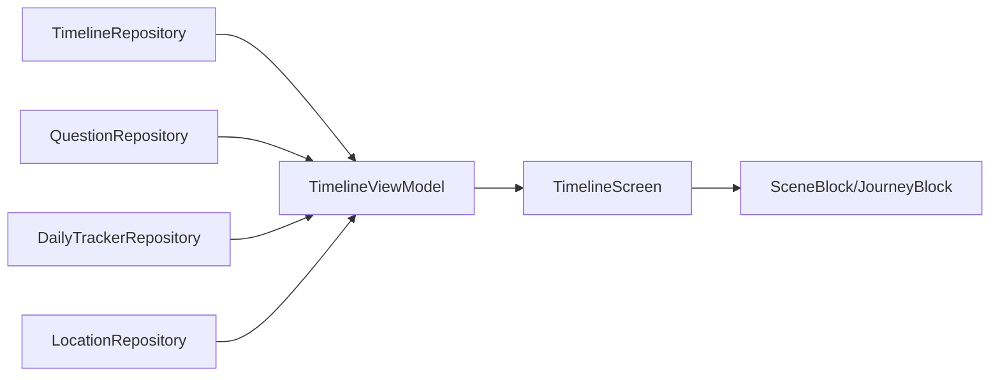

# 时间轴模块 (Timeline)

> 返回 [文档中心](../INDEX.md)

## 功能概述

时间轴模块是观己应用的核心主页，负责展示用户的日常记录流。它以时间为轴，将用户的文字、图片、音频、视频等多媒体内容组织成场景块(Scene)和旅程块(Journey)，提供沉浸式的生活记录体验。

### 核心价值
- 按时间和地点自动组织日记内容
- 支持多媒体混合记录（文字、图片、音频、视频、文件）
- 集成时间胶囊(Time Capsule)和时间涟漪(Time Ripple)功能
- 提供历史回顾和共鸣统计

## 用户场景

### 场景 1: 日常记录
用户在一天中随时记录想法、拍照、录音，系统自动根据时间和位置将内容组织到对应的场景块中。

### 场景 2: 历史回顾
用户可以通过侧边栏浏览历史日期的记录，查看"往年今日"的内容，产生时间共鸣。

### 场景 3: 时间胶囊
用户创建时间胶囊，设定未来某天打开，系统在到期日通过时间涟漪提醒用户。

## 交互流程



## 模块结构

### 文件组织

```
Features/Timeline/
├── TimelineScreen.swift          # 主视图
├── TimelineViewModel.swift       # 视图模型
└── Views/
    ├── CapsuleDetailSheet.swift      # 时间胶囊详情
    ├── TimelineEditingOverlay.swift  # 编辑覆盖层
    ├── TimeRippleSheet.swift         # 时间涟漪面板
    └── TimeRippleView.swift          # 时间涟漪入口视图
```

### 核心组件

| 组件 | 职责 |
|------|------|
| `TimelineScreen` | 主视图，管理UI状态和用户交互 |
| `TimelineViewModel` | 业务逻辑，数据加载和处理 |
| `SceneBlock` | 场景块渲染组件 |
| `JourneyBlock` | 旅程块渲染组件 |
| `InputDock` | 底部输入栏 |
| `DateWeatherHeader` | 日期天气头部 |

## 技术实现

### TimelineScreen

主视图负责：
- 根据 `AppState.currentMode` 切换时间轴/AI对话模式
- 管理侧边栏历史记录面板
- 处理各种 Sheet（编辑、时间胶囊、地点命名等）
- 响应系统通知（地址变更、时间轴更新等）

```swift
// 文件路径: Features/Timeline/TimelineScreen.swift
public struct TimelineScreen: View {
    @StateObject private var vm = TimelineViewModel()
    @EnvironmentObject private var appState: AppState
    
    // 根据模式切换内容
    var body: some View {
        Group {
            if appState.currentMode == .ai {
                AIConversationScreen()
            } else {
                scrollContent(proxy: proxy)
            }
        }
    }
}
```

### TimelineViewModel

视图模型负责：
- 加载指定日期的时间轴数据
- 处理日记条目的增删改
- 管理时间胶囊和问题回复
- 刷新地点映射
- 计算共鸣统计

```swift
// 文件路径: Features/Timeline/TimelineViewModel.swift
public final class TimelineViewModel: ObservableObject {
    @Published public private(set) var items: [TimelineItem] = []
    @Published public private(set) var displayItems: [TimelineItem] = []
    @Published public private(set) var todayQuestions: [QuestionEntry] = []
    @Published public var currentDate: String = DateUtilities.today
    @Published public private(set) var dailyTrackerRecord: DailyTrackerRecord? = nil
    
    // 核心方法
    public func load(date: String? = nil)
    public func handleTodaySubmit(text: String, images: [UIImage]?, ...)
    public func handleReply(questionId: String, replyText: String, ...)
    public func createCapsule(mode: String, prompt: String, ...)
    public func tagEntry(id: String, category: EntryCategory?)
    public func editEntryContent(id: String, newContent: String)
    public func deleteEntry(id: String)
    public func refreshLocationMappings()
}
```

### 数据流



## 关键功能

### 1. 内容过滤逻辑

`displayItems` 通过过滤 `items` 生成，隐藏以下内容：
- 封印记忆 (`subType == .pending_question`)
- 未来条目 (`chronology == .future`)
- 问题回复 (有 `questionId`)
- 时间胶囊源条目

### 2. 地点映射

系统自动将 GPS 坐标映射到用户定义的地点：
- 使用 `LocationService.suggestMappings()` 查找匹配
- 支持用户手动命名新地点
- 支持将新坐标追加到已有地点

### 3. 时间涟漪

时间涟漪展示今日到期的时间胶囊：
- 显示已回复/总数统计
- 点击进入详情查看原始内容和回复

## 依赖关系

### Repository 依赖
- `TimelineRepository`: 时间轴数据持久化
- `QuestionRepository`: 时间胶囊问题管理
- `DailyTrackerRepository`: 每日追踪记录
- `LocationRepository`: 地点映射管理

### Service 依赖
- `LocationService`: GPS 定位和地理编码
- `WeatherService`: 天气信息获取
- `TimelineRecorder`: 后台时间轴记录

### 通知监听
- `gj_addresses_changed`: 地址映射变更
- `gj_timeline_updated`: 时间轴数据更新
- `gj_submit_input`: 用户提交输入
- `gj_edit_entry`: 编辑条目
- `gj_delete_entry`: 删除条目
- `gj_day_end_time_changed`: 日结时间变更
- `gj_tracker_updated`: 追踪器数据更新

## 相关文档

- [数据架构](../architecture/data-architecture.md)
- [MVVM 模式](../architecture/mvvm-pattern.md)
- [时间轴模型](../data/timeline-models.md)
- [InputDock 组件](../components/organisms.md)

---
**版本**: v1.0.0  
**作者**: Kiro AI Assistant  
**更新日期**: 2024-12-17  
**状态**: 已发布
