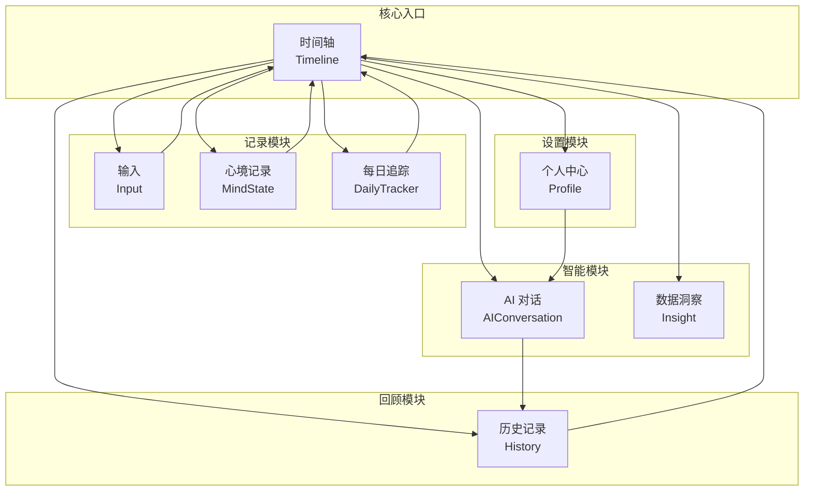
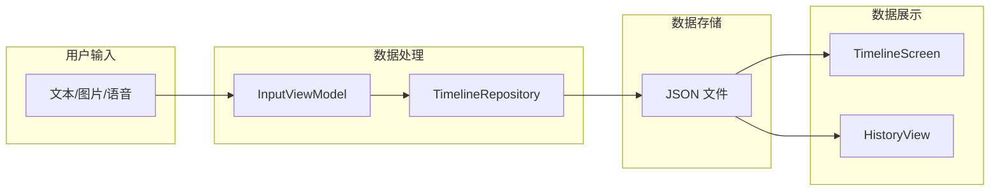

# 功能地图

> 返回 [文档中心](../INDEX.md)

## 功能概述

观己(Guanji)包含 8 个核心功能模块，围绕"记录-追踪-洞察"的核心理念构建。

## 功能模块关系图

## 模块详情

### 1. 时间轴 (Timeline)
**位置**: `Features/Timeline/`

| 文件 | 职责 |
|------|------|
| TimelineScreen.swift | 主页视图，展示日记流 |
| TimelineViewModel.swift | 数据管理和业务逻辑 |

**核心功能**:
- 动态日记流展示
- 场景块(SceneBlock)与旅程块(JourneyBlock)
- 天气信息集成
- 共鸣(Resonance)功能

### 2. AI 对话 (AIConversation)
**位置**: `Features/AIConversation/`

| 文件 | 职责 |
|------|------|
| AIConversationScreen.swift | 对话界面 |
| AIConversationViewModel.swift | 对话状态管理 |
| Views/MessageBubble.swift | 消息气泡组件 |
| Views/StreamingIndicator.swift | 流式响应指示器 |
| Views/ThinkingSection.swift | 思考过程展示 |

**核心功能**:
- 流式响应展示
- 思考过程可视化
- Markdown 富文本渲染
- 代码语法高亮

### 3. 每日追踪 (DailyTracker)
**位置**: `Features/DailyTracker/`

| 文件 | 职责 |
|------|------|
| DailyTrackerFlowScreen.swift | 追踪流程界面 |
| DailyTrackerViewModel.swift | 追踪数据管理 |

**核心功能**:
- 睡眠质量追踪
- 运动记录
- 饮食记录
- 自定义标签

### 4. 历史记录 (History)
**位置**: `Features/History/`

| 文件 | 职责 |
|------|------|
| HistorySidebar.swift | 历史侧边栏 |
| HistoryViewModel.swift | 历史数据管理 |
| Views/ConversationHistoryView.swift | 对话历史视图 |
| Views/GlobalHistoryView.swift | 全局历史视图 |
| Views/TimelineHistoryView.swift | 时间轴历史视图 |

**核心功能**:
- 按日期浏览
- 对话历史
- 时间轴历史
- 年月选择器

### 5. 输入 (Input)
**位置**: `Features/Input/`

| 文件 | 职责 |
|------|------|
| CapsuleCreatorSheet.swift | 时间胶囊创建 |
| InputViewModel.swift | 输入状态管理 |

**核心功能**:
- 文本输入
- 图片/视频上传
- 语音录制
- 时间胶囊

### 6. 数据洞察 (Insight)
**位置**: `Features/Insight/`

| 文件 | 职责 |
|------|------|
| InsightSheet.swift | 洞察展示界面 |
| InsightViewModel.swift | 数据分析逻辑 |

**核心功能**:
- 数据可视化
- 趋势分析
- 统计报告

### 7. 心境记录 (MindState)
**位置**: `Features/MindState/`

| 文件 | 职责 |
|------|------|
| MindStateFlowScreen.swift | 心境记录流程 |
| MindStateViewModel.swift | 心境数据管理 |

**核心功能**:
- 情绪值记录 (Valence)
- 情绪标签选择
- 影响因素记录
- 热力图分析

### 8. 个人中心 (Profile)
**位置**: `Features/Profile/`

包含 25 个子页面:

| 类别 | 页面 |
|------|------|
| 设置 | AISettingsScreen, NotificationsScreen |
| 用户画像 | UserProfileDetailScreen, NarrativeUserProfileScreen |
| 关系管理 | RelationshipManagementScreen, RelationshipDetailScreen, NarrativeRelationshipDetailScreen |
| 地点管理 | LocationListScreen, LocationDetailScreen, LocationMapPickerScreen |
| 会员 | MembershipScreen, SubscriptionInfoScreen |
| 系统 | AboutScreen, DataMaintenanceScreen, ComponentGalleryScreen |

## 数据流向图

## 相关文档

- [产品概述](product-overview.md) - 产品功能和技术栈
- [用户旅程](user-journey.md) - 核心用户场景
- [系统架构](../architecture/system-architecture.md) - 详细架构说明

---
**版本**: v1.0.0  
**作者**: Kiro AI Assistant  
**更新日期**: 2024-12-17  
**状态**: 已发布
