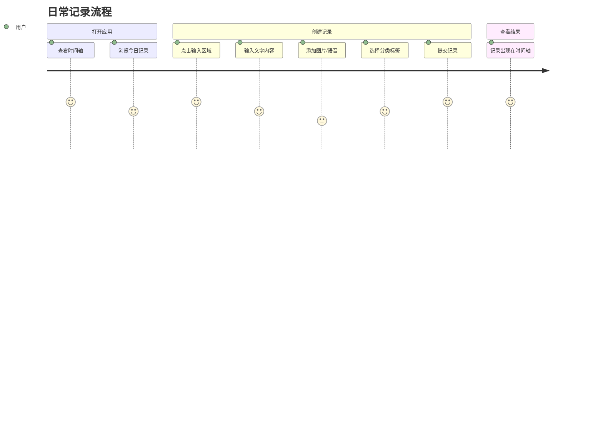
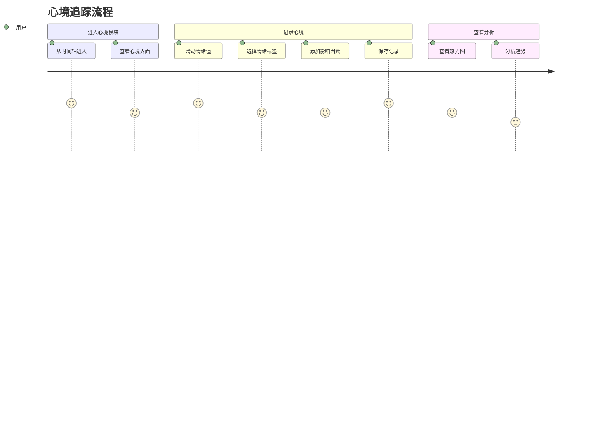
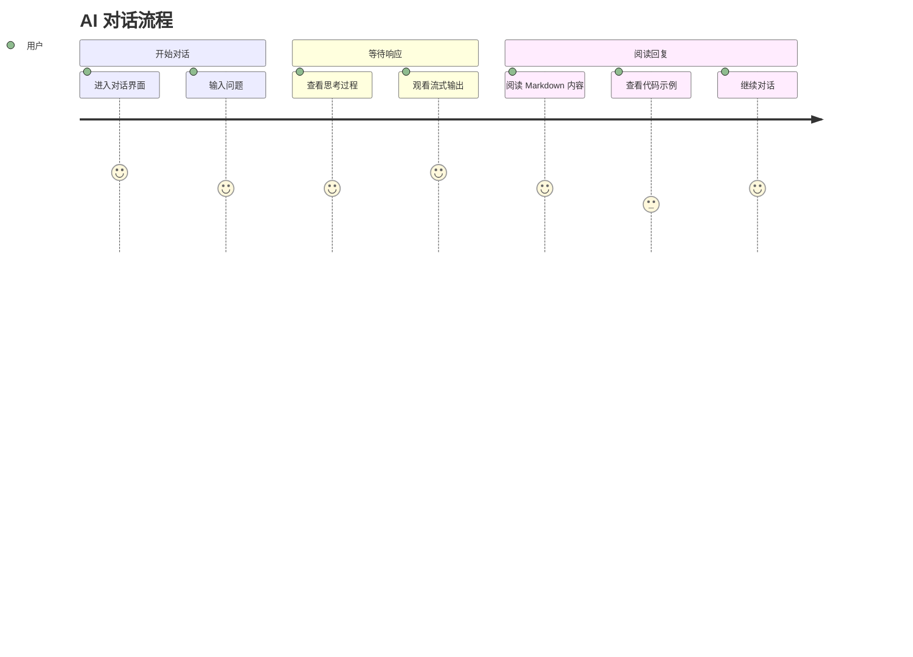
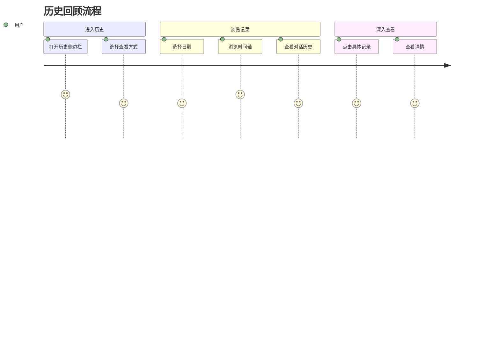
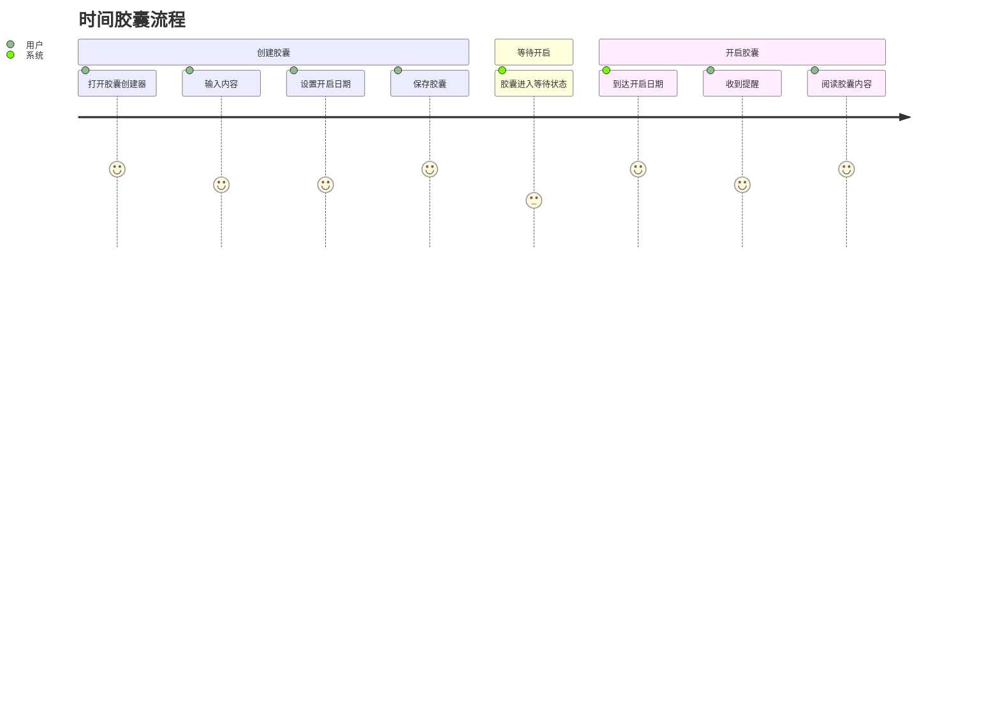
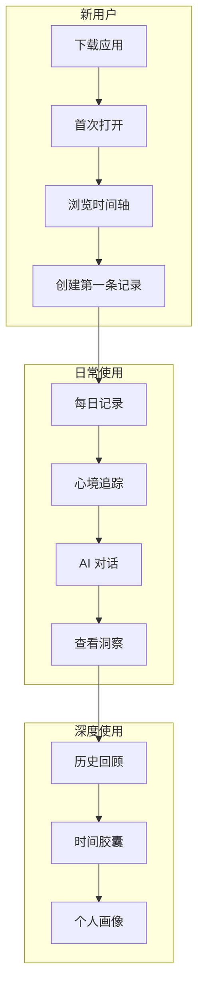

# 用户旅程

> 返回 [文档中心](../INDEX.md)

## 功能概述

本文档描述观己(Guanji)应用的核心用户场景和完整交互流程，帮助理解用户如何使用应用完成日常记录和自我洞察。

## 核心用户场景

### 场景 1: 日常记录

**用户目标**: 快速记录当下的想法、感受或事件

**交互流程**:

1. **打开应用** → 进入时间轴主页 (TimelineScreen)
2. **点击输入区域** → 展开输入面板 (InputDock)
3. **输入内容** → 支持文本、图片、语音
4. **选择分类** → 可选标签: dream, health, emotion, work, social, media, life
5. **提交记录** → 创建 JournalEntry，更新 DailyTimeline
6. **查看结果** → 新记录显示在时间轴顶部

### 场景 2: 心境追踪

**用户目标**: 记录当前情绪状态和影响因素

**交互流程**:

1. **进入心境模块** → 从时间轴导航到 MindStateFlowScreen
2. **设置情绪值** → 使用滑块设置 valenceValue (情绪效价)
3. **选择情绪标签** → 从预设标签中选择当前情绪
4. **添加影响因素** → 记录影响情绪的因素
5. **保存记录** → 创建 MindStateRecord
6. **查看分析** → 热力图展示情绪趋势

### 场景 3: AI 对话

**用户目标**: 与 AI 助手对话，获取个性化洞察

**交互流程**:

1. **进入对话界面** → 导航到 AIConversationScreen
2. **输入问题** → 在输入框中输入问题
3. **发送消息** → 消息发送到 AI 服务
4. **查看思考过程** → ThinkingSection 展示 AI 思考过程
5. **观看流式输出** → StreamingIndicator 显示实时响应
6. **阅读回复** → MessageBubble 渲染 Markdown 富文本

### 场景 4: 每日追踪

**用户目标**: 快速记录每日状态指标

**交互流程**:

1. **进入追踪模块** → 导航到 DailyTrackerFlowScreen
2. **记录睡眠** → 使用滑块记录睡眠质量
3. **记录运动** → 选择运动类型和时长
4. **添加标签** → 使用 TagInputChip 添加自定义标签
5. **保存记录** → 数据保存到 DailyTrackerRepository
6. **查看汇总** → DailyTrackerSummaryCard 展示今日状态

### 场景 5: 历史回顾

**用户目标**: 浏览过去的记录，回顾个人历史

**交互流程**:

1. **打开历史** → 展开 HistorySidebar
2. **选择查看方式** → 时间轴历史 / 对话历史 / 全局历史
3. **选择日期** → 使用 YearMonthPickerSheet 选择年月
4. **浏览记录** → 查看选定日期的所有记录
5. **查看详情** → 点击记录查看完整内容

### 场景 6: 时间胶囊

**用户目标**: 创建写给未来的记录

**交互流程**:

1. **打开创建器** → 进入 CapsuleCreatorSheet
2. **输入内容** → 写下想对未来说的话
3. **设置日期** → 选择胶囊开启日期
4. **保存胶囊** → 创建 chronology 为 future 的 JournalEntry
5. **等待开启** → 胶囊在指定日期前不可见
6. **开启阅读** → 到达日期后，胶囊出现在时间轴

## 用户旅程地图

## 关键触点

| 触点 | 用户期望 | 系统响应 |
|------|----------|----------|
| 打开应用 | 快速查看今日记录 | 展示时间轴主页 |
| 点击输入 | 快速开始记录 | 展开输入面板 |
| 提交记录 | 确认保存成功 | 动画反馈 + 更新时间轴 |
| 查看历史 | 快速定位日期 | 提供日期选择器 |
| AI 对话 | 获得有价值的回复 | 流式响应 + 富文本渲染 |

## 相关文档

- [产品概述](product-overview.md) - 产品功能和技术栈
- [功能地图](feature-map.md) - 功能模块关系图
- [时间轴模块](../features/timeline.md) - 时间轴详细文档

---
**版本**: v1.0.0  
**作者**: Kiro AI Assistant  
**更新日期**: 2024-12-17  
**状态**: 已发布
